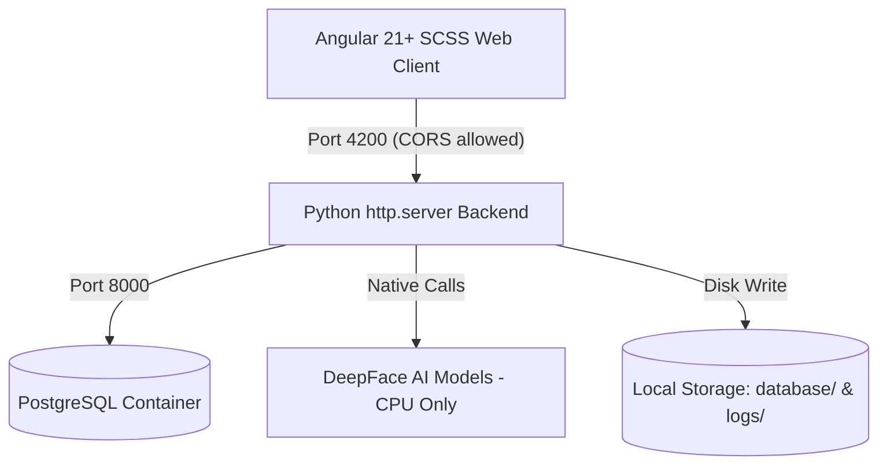

# Employee Face AI: System Specifications & Agent Guidelines

Welcome to the developer and AI agent documentation for **Employee Face AI** (formerly RoboFace AI). This file defines the system architecture, database relations, API schemas, design patterns, and development guidelines to maintain clean, standardized, non-hacky execution.

---

## 📌 Project Overview

**Employee Face AI** is a local, offline-capable enterprise kiosk and HR management system. It automatically identifies employees via webcam stream matching against a reference photo database and evaluates their dominant emotion/mood at each check-in.

---

## 🏗️ Technical Stack & Architecture



### 1. Backend Service (`server.py` & `db.py`)
- **Technology**: Pure Python standard library `http.server` (no Flask/FastAPI to respect the framework-less constraint).
- **Core ML Engine**: **DeepFace** with TensorFlow forced to **CPU-only mode** via `os.environ["CUDA_VISIBLE_DEVICES"] = "-1"` to prevent macOS Apple Silicon GPU compiling freezes.
- **Database Engine**: **PostgreSQL** running inside a Docker container (`port 5432`) with automatic schema initialization and data migrations.

### 2. Frontend Application (`/frontend` Workspace)
- **Technology**: **Angular v21+** configured with standalone component architectures, SCSS stylesheets, strict compiler configurations, and Vitest test runner.
- **State Management**: Reactive Angular **Signals** instead of complex stores. This project does **not** use `ReactiveFormsModule`/`FormGroup`/`FormControl` anywhere — every form is template-driven (`[ngModel]`/`(ngModelChange)`) backed by signals. Follow this pattern for new forms; don't introduce Reactive Forms.
- **Async & HTTP**: **RxJS** pipelines with a custom functional `HttpInterceptorFn` for silent token refresh.
- **Testing**: **Vitest** for unit tests, **Cypress** for end-to-end (E2E) verification. Run `cd frontend && npm test` before committing frontend changes — the README's test badge reflects the real pass count, so keep the suite green rather than deleting/skipping failing specs.
- **Layout**: All `/admin/*` routes are lazily loaded as children of `AdminShellComponent` (`src/app/core/components/admin-shell/`), which renders the persistent sidebar/nav and hosts the routed page via `<router-outlet>`. The `/staff` route is separate and unrelated: it loads `StaffProfileComponent` (`src/app/pages/staff/staff-profile/`) directly (no shell), a read-only self-service view for the logged-in employee's own profile.
- **Shared styles**: `src/styles/_hud-form.scss` is forwarded globally from `styles.scss` and holds every reusable HUD form/UI pattern (`.hud-filter-bar`, `.hud-field`, `.hud-input`, `.hud-btn-outline`, `.hud-btn-mini`, `[data-tooltip]` hover tooltips, `.form-camera-zone` webcam/upload capture, `.filter-apply-field`, `.field-hint`). Add new cross-page UI primitives here instead of redefining them per component — component-scoped styles win over the shared file automatically (Angular's emulated encapsulation adds a scoping attribute that out-specifies plain global selectors), so a page can still override a shared style locally when it genuinely needs to look different.
- **Shared services**: `src/app/core/services/credentials.util.ts` (password regex + hint text) and `username-check.service.ts` (calls the username-availability endpoint) are consumed by both the employee create and edit forms — reuse them rather than re-implementing validation logic per form.

---

## 💾 Database Schema Design (PostgreSQL)

To track the employee lifecycle comprehensively, the schema is normalized across 7 relations:

```
  +------------------+
  |    employees     |<---+
  +------------------+    |
  | id (PK)          |    | (1:N Cascaded Delete)
  | name, age        |    |
  | image_path       |    +-----+--------------------+--------------------+--------------------+
  | role, username,  |          |                    |                    |                    |
  | password         |          |                    |                    |                    |
  +------------------+   +------+------+      +------+------+      +------+------+      +------+------+
                         |  positions  |      |   skills     |      |  projects   |      |   income    |
                         +-------------+      +-------------+      +-------------+      +-------------+
                         | id (PK)     |      | id (PK)     |      | id (PK)     |      | id (PK)     |
                         | title       |      | skill_name  |      | proj_name   |      | amount      |
                         | start_date  |      | description |      | role, desc  |      | effective   |
                         | end_date    |      +-------------+      | start_date  |      | reason      |
                         +-------------+                           | end_date    |      +-------------+
                                                                   +-------------+
```

1. **`employees`**: Base identity profile. `username` is `UNIQUE` and nullable (existing rows without one simply can't log in until an admin assigns one via the edit form) — every login (admin or staff) is username + password, not the numeric `id`. `password` is stored as a PBKDF2-HMAC-SHA256 hash (`db.hash_password`/`db._check_password` in `db.py`), never plaintext — a startup migration (`db.migrate_legacy_passwords`) upgrades any legacy plaintext row it finds. `server.py` never touches the `password` column directly; it always goes through `db.py`'s functions.
2. **`employee_skills`**: Skills registry containing `skill_name` and custom competency `description`.
3. **`employee_positions`**: Title progressions over time. `end_date = NULL` represents the current active title.
4. **`employee_projects`**: Historic project assignments containing `project_name`, `role`, and `description` of duties.
5. **`employee_income_history`**: Compensation adjustment log containing `amount`, `effective_date`, and `change_reason`.
6. **`user_sessions`**: Session registry for token authorization (Access and Refresh Token).
7. **`attendance_logs`**: Check-in logs recording `timestamp`, `action` (CHECK_IN/OUT), identified employee ID, `mood` (dominant emotion), and audit photo path.

---

## ⚙️ Login & Role-Based Routing

`POST /api/login` takes `{ username, password }` (not the numeric employee `id`) and, on success, returns `{ tokens, user: { id, name, role } }`. The frontend never guesses the role — `AuthService.saveUser()` stores exactly what the backend returned. Post-login redirect and route protection both branch on `user.role`:

| Role | Redirect after login | Route guard | Area |
|---|---|---|---|
| `admin` | `/admin/dashboard` | `authGuard` (`role === 'admin'`) | Full HR console under `AdminShellComponent` |
| `staff` | `/staff` | `staffGuard` (`role === 'staff'`) | Read-only self-service profile |

Both guards clear the session and redirect to `/login` on failure — there is a single shared `/login` page for both roles, not separate login screens.

`GET /api/employees/:id` is the one endpoint both roles can call: admins can fetch any employee, staff can only fetch their own record (`user["employee_id"] == :id`, checked server-side in `handle_get_employee_detail`). Every other employee-data endpoint (`GET /api/employees`, `/api/logs`, all mutating routes) stays admin-only.

---

## ⚙️ Secure Token Lifecycle (Silent Refresh)

Rather than checking sessions on intervals, the application implements a reactive **HTTP Interceptor** flow:

```mermaid
sequenceDiagram
    participant Client as Angular Client
    participant Interceptor as Auth Interceptor
    participant Backend as Python API Server

    Client->>Interceptor: HTTP GET /api/employees/2
    Note over Interceptor: Appends Authorization: Bearer <Access Token>
    Interceptor->>Backend: Send Request
    Backend-->>Interceptor: HTTP 401 Unauthorized (Token Expired)
    
    rect rgb(10, 30, 50)
        Note over Interceptor: Intercepts 401 & locks queue
        Interceptor->>Backend: POST /api/refresh { refresh_token }
        Backend-->>Interceptor: HTTP 200 { new_access_token, new_refresh_token }
        Note over Interceptor: Updates tokens in storage & releases queue
    end

    Interceptor->>Backend: Retry HTTP GET /api/employees/2 with new token
    Backend-->>Client: HTTP 200 { employee details }
```



---

## 🎨 UI & Design Principles: Robotics / Cyberpunk HUD

Theme: **"Dark Glass on Light Canvas"** — defined in `frontend/src/styles/_design-tokens.scss` (forwarded globally via `styles.scss`). Always read/reuse the CSS custom properties there rather than hardcoding hex values.
- **Primary Color Palette**:
  - Page background: neutral near-black (`--color-bg-deep`, `#12181a`)
  - Card / header / panel surface: dark slate glass (`--color-bg-card`, `#1e2724`)
  - Accent / Primary lines: Neon Green (`--color-cyan`, `#39d353` — the variable is still named `--color-cyan` for historical reasons, but it now drives the primary green accent, not cyan)
  - Secondary success accent: Lime (`--color-green`, `#a3e635`)
  - Warnings / Delete buttons: Rose Red (`--color-red`, `#f43f5e`)
  - Caution: Orange (`--color-orange`, `#fb923c`) · Informational/neutral: Sky Blue (`--color-info`, `#38bdf8`)
- **Key Visuals**:
  - Live webcam preview is mirrored (`transform: scaleX(-1)`) so check-ins feel natural.
  - Video features a sliding laser-line scan overlay (`scanner-laser` SCSS) and background grids simulating visual mesh recognition.
  - Cards feature glassmorphic translucent layers (`backdrop-filter: blur(12px)`) and subtle border glows.
  - **No external chart libraries**: Peak hours are plotted using **native inline SVG `<path>` and `<circle>` tags** generated dynamically in TypeScript from Signal datasets. This keeps the workspace free of heavy node modules and layout bugs.

---

## 🤖 Rules for AI Agents Working in this Codebase

When writing code or modifications, you must strictly follow these rules:

1. **CPU Only for DeepFace**: Always place the following setup at the very top of `server.py` before importing TensorFlow or DeepFace:
   ```python
   import os
   os.environ["CUDA_VISIBLE_DEVICES"] = "-1"
   ```
2. **Reference Image Naming**: Save reference photos strictly as `database/{employee_id}.jpg`. Do not include employee names or special accents in the filenames, as DeepFace's internal file readers will crash on non-ASCII characters.
3. **No Frameworks on Backend**: Keep the backend in `server.py` using Python's standard library `http.server`. Do not introduce Flask, FastAPI, or Django unless explicitly requested by the user.
4. **Strong Typing in Angular**: Ensure all classes and payloads are strongly typed. Strict mode must remain enabled. Declare model interfaces in `src/app/core/models/` or inline when local.
5. **No Inline Quote Errors**: When binding SVG images or complex strings to templates, do not write nested backslashed string literals inside inline HTML event handlers (e.g. `(error)="..."`). Handle error fallbacks via class methods (e.g. `(error)="onImageError($event)"`) to avoid template compilation crashes.
6. **Port Mapping**:
   - Python Backend: Port `8000` (handles API endpoints and CORS configuration).
   - Angular Development Server: Port `4200` (communicates with the backend at `http://localhost:8000/api`).
7. **No Native Popups (Alert/Confirm)**: Do not use native browser `alert()` or `confirm()` dialogs. Inject the `DialogService` from `src/app/core/services/dialog.service` and invoke it asynchronously using Promises or async/await to guarantee a unified Cyberpunk HUD overlay experience.
8. **Standalone Components with OnPush Change Detection**: Every Angular component must be `standalone: true` (never declared in an `NgModule`) and explicitly configure `changeDetection: ChangeDetectionStrategy.OnPush` inside its `@Component` decorator to disable unnecessary dirty checking cycles and align with reactive Angular Signals workflows.
9. **Table Pagination & Filtering**: Any table displaying lists of data (e.g. employee directories, audit logs) must implement reactive filters (start date, end date, text search) and pagination controls (currentPage, pageSize, totalPages) using Angular Signals. This guarantees visual stability and stops tables from expanding infinitely.
10. **Date-Range Filters Require an Apply Action**: Date-range pickers must NOT refilter data on every `(ngModelChange)`. Bind the inputs to draft signals (e.g. `filterStartDateInput`/`filterEndDateInput`) and only copy them into the applied signals (`filterStartDate`/`filterEndDate`, consumed by the `computed()` that does the filtering) inside an `applyDateFilter()` method wired to an explicit "ÁP DỤNG" button (`.hud-field.filter-apply-field` + `.hud-btn-outline`, both defined in `_hud-form.scss`). Free-text/autocomplete search fields (e.g. employee name search) are exempt and may stay live-filtering, since selecting a suggestion is itself the "apply" action.
11. **Serving Reference Photos**: Employee avatars are fetched by the frontend as `http://localhost:8000/{image_path}` (e.g. `database/3.jpg`). `server.py`'s `do_GET` routes `/database/*` requests to `serve_database_image()`, which resolves the path against the `database/` root and rejects anything that escapes it (checked via `os.path.commonpath`) — never bypass this guard or serve arbitrary filesystem paths. An employee's avatar can be replaced from the employee-detail edit modal (webcam capture or file upload, same UI/flow as new-employee registration) via `PUT /api/employees/:id` with an optional base64 `img` field.
12. **Full-Replace Update Endpoints**: `PUT /api/employees/:id` (and the skills/projects sub-resources) fully replace the skills/projects lists based on whatever arrays are present in the request body — omitting `skills`/`projects` from a manual/partial request wipes them. Always send the complete current list back when updating any part of an employee's profile.
13. **Username & Password Rules**: Every employee account requires a unique `username` and a password meeting `PASSWORD_PATTERN` (min 8 chars, upper + lower + digit + special char). This pattern exists in **two places that must stay in sync**: `PASSWORD_PATTERN` in `server.py` (Python `re`) and `PASSWORD_PATTERN` in `frontend/src/app/core/services/credentials.util.ts` (JS regex) — there's no shared source across the two languages, so update both together. On the employee **edit** form, an empty password field means "keep the existing password" (only validate complexity when non-empty); on the **create** form, both username and password are always required.
14. **Async Username Availability Check**: Don't use Angular's `AsyncValidatorFn`/Reactive Forms for this (see rule above about template-driven forms). Follow the existing manual-debounce pattern in `employee-list.ts`/`employee-detail.ts`: a `setTimeout`/`clearTimeout` timer (~450ms) on `(ngModelChange)` calls `UsernameCheckService.check(username, excludeId?)` against `GET /api/employees/check-username`, and a `'idle' | 'checking' | 'available' | 'taken'` signal drives both the inline `.field-hint` message and the submit button's `[disabled]` state. Always pass `excludeId` (the employee's own id) on edit forms so an unchanged username doesn't falsely flag as taken.
15. **Leave Timeline Height Limits**: To avoid infinite vertical timeline stretching, historical lists or timelines (like the leave requests history on the staff profile) must be wrapped in a container (e.g. `.timeline-container`) with a fixed maximum height (e.g., `290px`) and custom scrollbars styled to match the dark-green HUD aesthetic.
16. **Short Polling for Realtime Updates**: Instead of persistent streaming mechanisms (SSE, WebSockets) which block connection threads in Python's standard `http.server` library, implement a debounced background polling interval (e.g. 3 seconds via `setInterval`) inside components for quiet updates to data signals.
17. **Global Service Guarding**: Global Angular services (like `RealtimeService`) that poll or fetch data on initialization must check authorization levels (e.g., `authService.isAdmin()`) before querying admin-only endpoints. This prevents infinite 401 token refresh loops when a standard staff user logs in.
18. **Prevent Circle Distortion in Flexbox**: Elements styled as circular via `border-radius: 50%` (such as `.avatar-frame` and `.profile-pic-frame`) placed inside a flexbox container must explicitly set `flex: none;` (or `flex-shrink: 0`) to prevent the browser from squishing them into ovals/ellipses.
19. **Clean Code Tooling — Zero-Warning Policy**: Both stacks are linted and must stay at **zero errors**.
    - **Backend**: **Ruff** (config in `pyproject.toml`) replaces Black/Flake8/isort — run `ruff check --fix . && ruff format .` before committing backend changes. Rule set: `E`, `W`, `F`, `I`, `B`, `UP` (line length `E501` is ignored; the formatter handles wrapping, not a hard rule).
    - **Frontend**: **Angular ESLint** (flat config in `frontend/eslint.config.js`) covers both `.ts` (typescript-eslint + angular-eslint rules) and `.html` (angular-eslint template rules, including a11y: `label-has-associated-control`, `alt-text`) — run `cd frontend && npm run lint` before committing frontend changes. In particular:
      - **No `any`**: type HTTP responses with the generic `ApiResponse<T>` wrapper (`src/app/core/models/api-response.model.ts`) and the shared domain models in `src/app/core/models/` (`employee.model.ts`, `leave-request.model.ts`, `dialog-state.model.ts`). Type `HttpClient` error callbacks as `HttpErrorResponse` (`@angular/common/http`), `catch` blocks as `unknown` with an `instanceof Error` narrow, `FileReader.onload` events as `ProgressEvent<FileReader>`, and timer handles as `ReturnType<typeof setTimeout>`/`ReturnType<typeof setInterval>` — never `any`.
      - **Labels need a real control**: every `<label>` must have `for`/`id` pointing at the native `<input>`/`<select>`/`<textarea>` it describes. A label sitting next to a custom component (e.g. `<app-date-picker>`) or with no control at all (a section heading used for visual spacing) must be a `<span>`, not a `<label>`.
      - Every `` needs a meaningful `alt`.
    - Run both linters (and `npx tsc --noEmit -p tsconfig.app.json` for the frontend) after any multi-file change, not just the files you touched directly — fixing one file's types can surface a pre-existing but previously-masked error elsewhere (e.g. tightening `dialogState`'s type once surfaced a real `TS2774` always-true check in `hud-dialog.ts`).
20. **No `any`, Ever**: TypeScript `any` — implicit or explicit — is never allowed anywhere in the Angular codebase, no exceptions, not even as a temporary stopgap "to fix later". Use the shared model types in `src/app/core/models/`, `HttpErrorResponse` for `HttpClient` error callbacks, `unknown` + `instanceof` narrowing for `catch` blocks, and precise DOM event types (`ProgressEvent<FileReader>`, etc. — see rule 19). If a value's shape is genuinely unknown, type it `unknown` and narrow it — never reach for `any`.
21. **CSS Values Must Come From Design Tokens**: Never hardcode a color or a magic-number size (px/rem for spacing, radius, font-size, etc.) directly inside a component's SCSS. Reuse the CSS custom properties defined in `frontend/src/styles/_design-tokens.scss` (colors, spacing scale, typography scale) and the shared HUD primitives in `_hud-form.scss`. If a genuinely new value is needed, add it as a token in `_design-tokens.scss` first and reference it from there — don't inline a raw literal in component styles.
22. **No Duplicated Code**: Before writing logic, markup, or styles that resemble something already used elsewhere (a debounce timer, an HTTP error-handling pattern, a modal skeleton, a label+input pair, a webcam-capture flow), check `src/app/core/services/`, `src/app/core/models/`, `src/app/core/components/`, and `_hud-form.scss` first and reuse or extend it instead of copy-pasting the same block into a third file. If the same pattern is about to appear a third time, extract it into a shared service/util/component.
23. **No `@Input`/`@Output`/`@ViewChild`/`@ContentChild` Decorators**: Use the signal-based equivalents instead — `input()`/`input.required()`, `output()`, `viewChild()`/`viewChild.required()`, `contentChild()` — consistent with the existing codebase (see `viewChild<ElementRef<...>>('videoElement')` in `employee-list.ts`, `employee-detail.ts`, `kiosk.ts`, `staff-profile.ts`). Never add the classic decorator forms to new or edited components.
24. **Clean Code Is Part of "Done"**: A task is not complete just because the feature works — before reporting any task as finished, run the relevant linters with zero errors: backend changes require `ruff check . && ruff format --check .` to pass clean; frontend changes require `cd frontend && npm run lint` and `npx tsc --noEmit -p tsconfig.app.json` to both pass clean. Fix any errors surfaced before declaring the task done, even if they're in a file you didn't directly intend to touch.

---

## 🚀 Dev Commands Reference

- **Start whole project (Database, API, and Client concurrently)**:
  ```bash
  ./start.sh
  ```
- **Spin up Postgres Database container**:
  ```bash
  docker compose up -d
  ```
- **Drop Postgres database tables (Clean reset)**:
  ```bash
  python -c "import psycopg2; conn = psycopg2.connect(host='localhost', port=5432, user='postgres', password='mysecretpassword', dbname='employee_face_ai'); cur = conn.cursor(); cur.execute('DROP TABLE IF EXISTS user_sessions, attendance_logs, employee_income_history, employee_projects, employee_positions, employee_skills, employees CASCADE;'); conn.commit(); conn.close(); print('DB Reset Complete.')"
  ```
- **Launch Python Server**:
  ```bash
  ./venv/bin/python server.py
  ```
- **Launch Angular Client**:
  ```bash
  cd frontend
  npm start
  ```
- **Build Production frontend bundle**:
  ```bash
  cd frontend
  npm run build
  ```
- **Run frontend unit tests** (Vitest):
  ```bash
  cd frontend
  npm test
  ```
- **Lint & format backend** (Ruff):
  ```bash
  ruff check --fix . && ruff format .
  ```
- **Lint frontend** (Angular ESLint):
  ```bash
  cd frontend
  npm run lint
  ```

> Looking for the public-facing project intro instead of agent/dev internals? See [README.md](README.md).
