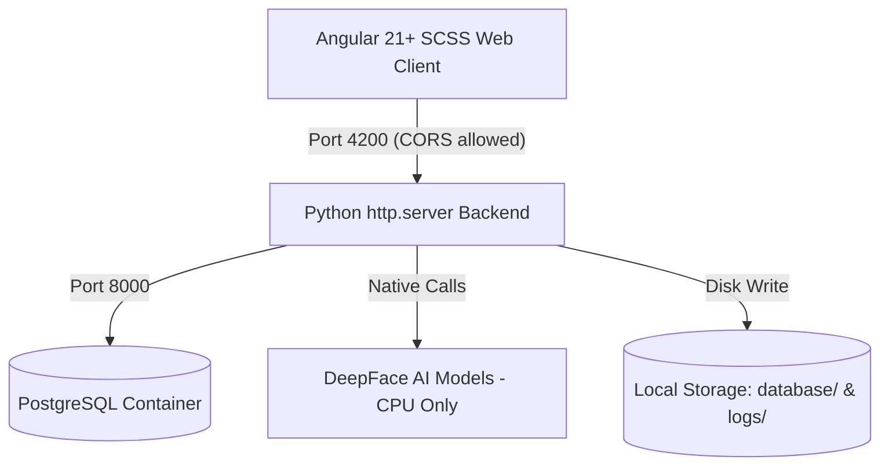

# Employee Face AI: System Specifications & Agent Guidelines

Welcome to the developer and AI agent documentation for **Employee Face AI** (formerly RoboFace AI). This file defines the system architecture, database relations, API schemas, design patterns, and development guidelines to maintain clean, standardized, non-hacky execution.

---

## 📌 Project Overview

**Employee Face AI** is a local, offline-capable enterprise kiosk and HR management system. It automatically identifies employees via webcam stream matching against a reference photo database and evaluates their dominant emotion/mood at each check-in.

---

## 🏗️ Technical Stack & Architecture



### 1. Backend Service (`server.py` & `db.py`)
- **Technology**: Pure Python standard library `http.server` (no Flask/FastAPI to respect the framework-less constraint).
- **Core ML Engine**: **DeepFace** with TensorFlow forced to **CPU-only mode** via `os.environ["CUDA_VISIBLE_DEVICES"] = "-1"` to prevent macOS Apple Silicon GPU compiling freezes.
- **Database Engine**: **PostgreSQL** running inside a Docker container (`port 5432`) with automatic schema initialization and data migrations.

### 2. Frontend Application (`/frontend` Workspace)
- **Technology**: **Angular v21+** configured with standalone component architectures, SCSS stylesheets, strict compiler configurations, and Vitest test runner.
- **State Management**: Reactive Angular **Signals** instead of complex stores.
- **Async & HTTP**: **RxJS** pipelines with a custom functional `HttpInterceptorFn` for silent token refresh.
- **Testing**: **Vitest** for unit tests, **Cypress** for end-to-end (E2E) verification.

---

## 💾 Database Schema Design (PostgreSQL)

To track the employee lifecycle comprehensively, the schema is normalized across 7 relations:

```
  +------------------+
  |    employees     |<---+
  +------------------+    |
  | id (PK)          |    | (1:N Cascaded Delete)
  | name, age        |    |
  | image_path       |    +-----+--------------------+--------------------+--------------------+
  | role, password   |          |                    |                    |                    |
  +------------------+   +------+------+      +------+------+      +------+------+      +------+------+
                         |  positions  |      |   skills     |      |  projects   |      |   income    |
                         +-------------+      +-------------+      +-------------+      +-------------+
                         | id (PK)     |      | id (PK)     |      | id (PK)     |      | id (PK)     |
                         | title       |      | skill_name  |      | proj_name   |      | amount      |
                         | start_date  |      | description |      | role, desc  |      | effective   |
                         | end_date    |      +-------------+      | start_date  |      | reason      |
                         +-------------+                           | end_date    |      +-------------+
                                                                   +-------------+
```

1. **`employees`**: Base identity profile.
2. **`employee_skills`**: Skills registry containing `skill_name` and custom competency `description`.
3. **`employee_positions`**: Title progressions over time. `end_date = NULL` represents the current active title.
4. **`employee_projects`**: Historic project assignments containing `project_name`, `role`, and `description` of duties.
5. **`employee_income_history`**: Compensation adjustment log containing `amount`, `effective_date`, and `change_reason`.
6. **`user_sessions`**: Session registry for token authorization (Access and Refresh Token).
7. **`attendance_logs`**: Check-in logs recording `timestamp`, `action` (CHECK_IN/OUT), identified employee ID, `mood` (dominant emotion), and audit photo path.

---

## ⚙️ Secure Token Lifecycle (Silent Refresh)

Rather than checking sessions on intervals, the application implements a reactive **HTTP Interceptor** flow:

```mermaid
sequenceDiagram
    participant Client as Angular Client
    participant Interceptor as Auth Interceptor
    participant Backend as Python API Server

    Client->>Interceptor: HTTP GET /api/employees/2
    Note over Interceptor: Appends Authorization: Bearer <Access Token>
    Interceptor->>Backend: Send Request
    Backend-->>Interceptor: HTTP 401 Unauthorized (Token Expired)
    
    rect rgb(10, 30, 50)
        Note over Interceptor: Intercepts 401 & locks queue
        Interceptor->>Backend: POST /api/refresh { refresh_token }
        Backend-->>Interceptor: HTTP 200 { new_access_token, new_refresh_token }
        Note over Interceptor: Updates tokens in storage & releases queue
    end

    Interceptor->>Backend: Retry HTTP GET /api/employees/2 with new token
    Backend-->>Client: HTTP 200 { employee details }
```



---

## 🎨 UI & Design Principles: Robotics / Cyberpunk HUD

To maintain the requested visual excellence:
- **Primary Color Palette**:
  - Main Background: Deep Space Black (`#050811`)
  - Accent / Primary lines: Glowing Neon Cyan (`#00f0ff`)
  - Success Badges: Neon Green (`#00ff66`)
  - Warnings / Delete buttons: Neon Pink/Red (`#ff0055`)
- **Key Visuals**:
  - Live webcam preview is mirrored (`transform: scaleX(-1)`) so check-ins feel natural.
  - Video features a sliding laser-line scan overlay (`scanner-laser` SCSS) and background grids simulating visual mesh recognition.
  - Cards feature glassmorphic translucent layers (`backdrop-filter: blur(12px)`) and subtle border cyan glows.
  - **No external chart libraries**: Peak hours are plotted using **native inline SVG `<path>` and `<circle>` tags** generated dynamically in TypeScript from Signal datasets. This keeps the workspace free of heavy node modules and layout bugs.

---

## 🤖 Rules for AI Agents Working in this Codebase

When writing code or modifications, you must strictly follow these rules:

1. **CPU Only for DeepFace**: Always place the following setup at the very top of `server.py` before importing TensorFlow or DeepFace:
   ```python
   import os
   os.environ["CUDA_VISIBLE_DEVICES"] = "-1"
   ```
2. **Reference Image Naming**: Save reference photos strictly as `database/{employee_id}.jpg`. Do not include employee names or special accents in the filenames, as DeepFace's internal file readers will crash on non-ASCII characters.
3. **No Frameworks on Backend**: Keep the backend in `server.py` using Python's standard library `http.server`. Do not introduce Flask, FastAPI, or Django unless explicitly requested by the user.
4. **Strong Typing in Angular**: Ensure all classes and payloads are strongly typed. Strict mode must remain enabled. Declare model interfaces in `src/app/core/models/` or inline when local.
5. **No Inline Quote Errors**: When binding SVG images or complex strings to templates, do not write nested backslashed string literals inside inline HTML event handlers (e.g. `(error)="..."`). Handle error fallbacks via class methods (e.g. `(error)="onImageError($event)"`) to avoid template compilation crashes.
6. **Port Mapping**:
   - Python Backend: Port `8000` (handles API endpoints and CORS configuration).
   - Angular Development Server: Port `4200` (communicates with the backend at `http://localhost:8000/api`).
7. **No Native Popups (Alert/Confirm)**: Do not use native browser `alert()` or `confirm()` dialogs. Inject the `DialogService` from `src/app/core/services/dialog.service` and invoke it asynchronously using Promises or async/await to guarantee a unified Cyberpunk HUD overlay experience.
8. **OnPush Change Detection**: Every Angular component must explicitly configure `changeDetection: ChangeDetectionStrategy.OnPush` inside its `@Component` decorator to disable unnecessary dirty checking cycles and align with reactive Angular Signals workflows.
9. **Table Pagination & Filtering**: Any table displaying lists of data (e.g. employee directories, audit logs) must implement reactive filters (start date, end date, text search) and pagination controls (currentPage, pageSize, totalPages) using Angular Signals. This guarantees visual stability and stops tables from expanding infinitely.

---

## 🚀 Dev Commands Reference

- **Start whole project (Database, API, and Client concurrently)**:
  ```bash
  ./start.sh
  ```
- **Spin up Postgres Database container**:
  ```bash
  docker compose up -d
  ```
- **Drop Postgres database tables (Clean reset)**:
  ```bash
  python -c "import psycopg2; conn = psycopg2.connect(host='localhost', port=5432, user='postgres', password='mysecretpassword', dbname='employee_face_ai'); cur = conn.cursor(); cur.execute('DROP TABLE IF EXISTS user_sessions, attendance_logs, employee_income_history, employee_projects, employee_positions, employee_skills, employees CASCADE;'); conn.commit(); conn.close(); print('DB Reset Complete.')"
  ```
- **Launch Python Server**:
  ```bash
  ./venv/bin/python server.py
  ```
- **Launch Angular Client**:
  ```bash
  cd frontend
  npm start
  ```
- **Build Production frontend bundle**:
  ```bash
  cd frontend
  npm run build
  ```
