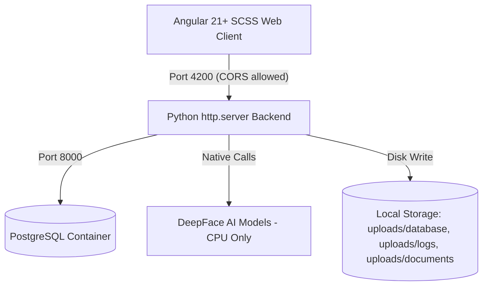

# Employee Face AI: System Specifications & Agent Guidelines

Welcome to the developer and AI agent documentation for **Employee Face AI** (formerly RoboFace AI). This file defines the system architecture, database relations, API schemas, design patterns, and development guidelines to maintain clean, standardized, non-hacky execution.

---

## 📌 Project Overview

**Employee Face AI** is a local, offline-capable enterprise kiosk and HR management system. It automatically identifies employees via webcam stream matching against a reference photo database and evaluates their dominant emotion/mood at each check-in.

---

## 🏗️ Technical Stack & Architecture



### 1. Backend Service (`server.py` & `db.py`)
- **Technology**: Pure Python standard library `http.server` (no Flask/FastAPI to respect the framework-less constraint).
- **Core ML Engine**: **DeepFace** with TensorFlow forced to **CPU-only mode** via `os.environ["CUDA_VISIBLE_DEVICES"] = "-1"` to prevent macOS Apple Silicon GPU compiling freezes.
- **Database Engine**: **PostgreSQL** running inside a Docker container (`port 5432`) with automatic schema initialization and data migrations.
- **Concurrency**: `ThreadingHTTPServer` (not the single-threaded `HTTPServer`) so one slow check-in request doesn't block every other client while it waits. `DEEPFACE_LOCK` (`threading.Lock`) still serializes the actual DeepFace calls underneath, since the library itself isn't thread-safe — the threading gets you concurrent request *handling*, not concurrent DeepFace inference.
- **Login rate-limiting**: `check_login_rate_limit`/`record_login_failure`/`reset_login_attempts` in `server.py`, keyed on `(client_ip, username)` behind `LOGIN_ATTEMPTS_LOCK`. `MAX_LOGIN_ATTEMPTS = 5` failures locks that pair out for `LOGIN_LOCKOUT_SECONDS` (5 minutes).
- **Upload size cap**: `MAX_IMAGE_BYTES = 8 MB` — any base64 image payload (registration, avatar update, check-in) over this is rejected before it's written to disk or handed to DeepFace.
- **Audit photo retention**: check-in/out audit photos in `uploads/logs/` are pruned by a background thread (`cleanup_old_audit_logs`, runs every 24h) once older than `LOG_RETENTION_DAYS = 90` days — `uploads/logs/` is not unbounded. Separately, `backend.log`/`frontend.log` (plain stdout redirects) are rotated by `start.sh` itself (not Python) once a file exceeds 5 MB, keeping 3 numbered backups.

### 2. Frontend Application (`/frontend` Workspace)
- **Technology**: **Angular v21+** configured with standalone component architectures, SCSS stylesheets, strict compiler configurations, and Vitest test runner.
- **State Management**: Reactive Angular **Signals** for everything that isn't a form field — table data, pagination, computed aggregates, applied filter values (rule 10). Every form (any component with `<input>`/`<select>`/`<textarea>` bound to user-editable state) uses **`ReactiveFormsModule`** (`FormBuilder.nonNullable.group({...})`/`FormGroup`/`FormControl`, template bound via `[formGroup]`/`formControlName`/`[formControl]`) instead of `FormsModule`/`[ngModel]`. This project does **not** use template-driven forms anywhere. A component that's fed its editable value via `input()` rather than owning it directly (e.g. `attendance-summary`, `logs-table`'s page-size select) still binds its own template through a local `FormControl` that's synced from the input via `effect()` and whose `valueChanges` re-emits the existing `output()` — see `attendance-summary.ts` — so the parent-facing `input()`/`output()` contract never changes just because the binding mechanism did. Two patterns to reuse: (1) simple field forms — `login.ts`, `employee-list.ts`'s registration form; (2) add-to-temp-list-then-save forms (`skills-panel.ts`, `projects-panel.ts`, `income-history.ts`, `positions-timeline.ts`) — the "new item" fields are a small `FormGroup` reset via `.reset()` after each add, while the already-added temp list itself stays a plain Signal (it's committed-but-unsaved data, not a form). A `computed()` that needs to react to a control's live value must read it through `toSignal(control.valueChanges, { initialValue: control.value })` first (see `employee-list.ts`'s `canSubmit`) — `computed()` only tracks Signal reads, so a raw `.value` read inside one goes stale; a **plain template expression** (not a `computed()`) can read `.value` directly since Reactive Forms directives call `markForCheck()` on every value change under `OnPush`.
- **Async & HTTP**: **RxJS** pipelines with a custom functional `HttpInterceptorFn` for silent token refresh.
- **Testing**: **Vitest** for unit tests, **Cypress** for end-to-end (E2E) verification. Run `cd frontend && npm test` before committing frontend changes — the README's test badge reflects the real pass count, so keep the suite green rather than deleting/skipping failing specs. E2E specs live in `frontend/cypress/e2e/` (one file per route/page), with shared login/webcam helpers in `frontend/cypress/support/commands.ts` (`cy.loginAsAdmin()`/`cy.loginAsStaff()` seed a fake session into `localStorage` via `cy.visit`'s `onBeforeLoad`, `cy.mockGetUserMedia()`/`stubGetUserMedia()` stub the webcam with a canvas-sourced `MediaStream`) and JSON fixtures in `frontend/cypress/fixtures/`. Every spec stubs backend calls with `cy.intercept()` rather than hitting the real Python/DeepFace backend — real face-matching can't be exercised headlessly, and hitting the live dev DB would make specs flaky/order-dependent. Run with `npm run e2e` (interactive) or `npm run e2e:run` (headless); only `npm start` needs to be running first, not the backend.
- **Layout**: All `/admin/*` routes are lazily loaded as children of `AdminShellComponent` (`src/app/core/components/admin-shell/`), which renders the persistent sidebar/nav and hosts the routed page via `<router-outlet>`. The `/staff` route is separate and unrelated: it loads `StaffProfileComponent` (`src/app/pages/staff/staff-profile/`) directly (no shell), a read-only self-service view for the logged-in employee's own profile.
- **Splitting a large page into components**: two established precedents, pick based on the pieces' shape. `dashboard/components/` (`stat-widget`, `hourly-chart`, `mood-donut`, `logs-table`) are all **dumb/presentational** — the parent keeps every computed signal and all state, children only get `input()`/`output()`. `employee-detail/components/` (`attendance-summary`, `positions-timeline`, `income-history`, `skills-panel`, `projects-panel`, `base-profile-modal`) mixes that same dumb pattern (`attendance-summary`) with **self-contained** children for anything that owns its own modal + its own HTTP save/delete calls (the other five) — those emit a `changed`/`saved` output so the parent knows to reload, but manage their own local editing state and API calls internally. Don't invent a third pattern; match whichever of these two a given piece is closer to.
- **Shared styles**: `src/styles/_hud-form.scss` is `@use`d globally from `styles.scss`, but is itself just a barrel — it `@forward`s a set of topic-based partials under `src/styles/hud-form/` (`_filter-bar.scss`, `_buttons.scss`, `_inputs.scss`, `_pagination.scss`, `_camera-capture.scss`, `_states.scss`, `_misc.scss`) that together hold every reusable HUD form/UI pattern (`.hud-filter-bar`, `.hud-field`, `.hud-input`, `.hud-btn-outline`, `.hud-btn-mini`, `[data-tooltip]` hover tooltips, `.form-camera-zone` webcam/upload capture, `.filter-apply-field`, `.field-hint`, pagination, loading/error states, etc.) — see the file-by-file breakdown listed in `_hud-form.scss`'s own header comment. Add a new class to whichever partial it topically belongs to (or a new partial + `@forward` line if none fit) rather than growing one file indefinitely. `src/styles/_employee-profile.scss` (same global-`@use` mechanism, still a single file) holds the more specific "employee profile detail" patterns — profile header, `.lifecycle-card`/`.timeline*`/`.comp-*`/`.skills-grid`/`.projects-timeline` display blocks, and the shared modal/form-editor CSS (`.modal-*`, `.form-fields`, `.hud-btn-success`/`.hud-btn-secondary`, `.skills-editor-*`/`.projects-editor-*`) — shared by the admin `employee-detail` page (and its `components/` children: `attendance-summary`, `positions-timeline`, `income-history`, `skills-panel`, `projects-panel`, `base-profile-modal`) and the read-only staff `staff-profile` page. Add new cross-page UI primitives to one of these two locations instead of redefining them per component, and never point one component's `styleUrls` at another component's own `.scss` file — if two or more components need the same styles, that's the signal to extract/move them into a shared global partial like these, not to reach across component boundaries. Component-scoped styles still win over the shared files automatically (Angular's emulated encapsulation adds a scoping attribute that out-specifies plain global selectors), so a page can still override a shared style locally when it genuinely needs to look different.
- **Shared services**: `src/app/core/services/credentials.util.ts` (password regex + hint text) and `username-check.service.ts` (calls the username-availability endpoint) are consumed by both the employee create and edit forms — reuse them rather than re-implementing validation logic per form. `src/app/core/services/webcam-capture.service.ts` (`WebcamCaptureService` + `readFileAsBase64()`) owns the start/stop/mirrored-snapshot webcam flow shared by every avatar/registration capture UI — provide it **per-component** (`providers: [WebcamCaptureService]` in `@Component`, never `providedIn: 'root'`), since each active webcam session needs its own `MediaStream`, not one shared singleton. Two more per-component services sit on top of it, extracted after the same orchestration logic was found duplicated across 3+ components: `photo-capture-state.service.ts` (`PhotoCaptureStateService`) owns the `imgBase64`/`showWebcam` state and the `startWebcam`/`stopWebcam`/`capturePhoto`/`triggerFileInput`/`handleFileUpload` methods shared by `employee-list`'s registration form, `base-profile-modal`, and `staff-profile`'s avatar-change modal — since `viewChild()` refs can only be declared on the host component, call `configure({ videoElement, canvasElement, fileInputElement })` once (in the constructor) with the component's own viewChild signals. `attendance-summary-state.service.ts` (`AttendanceSummaryStateService`) owns the date-range filter, pagination, and the CHECK_IN/CHECK_OUT-pairing working-hours aggregation consumed by `<app-attendance-summary>`, shared by `employee-detail` and `staff-profile` — call `configure(rawLogsSignal)` once (in the constructor) with a `Signal<AttendanceLog[]>` (e.g. `computed(() => this.employee()?.raw_logs || [])`) so its internal computeds react to that component's own `employee` signal. Both follow the same per-component-provided pattern as `WebcamCaptureService` — never `providedIn: 'root'`. `src/app/core/services/employee.service.ts` (`EmployeeService`, `providedIn: 'root'` — unlike the three above, this is stateless request plumbing, not per-page UI state) is the single source of truth for every `/employees...`-prefixed endpoint (`getAll`/`getById`/`create`/`update`/`delete`/`changePassword`/`changeAvatar`/`updateSkills`/`addPosition`/`addIncome`/`updateProjects`/`getLeaveRequests`/`submitLeaveRequest`/`getDocuments`) — before it existed, `${this.apiUrl}/employees...` was hand-built at 15+ call sites (several the exact same `GET /employees`/`GET /employees/:id` call repeated verbatim across `dashboard`, `documents`, `employee-list`, `employee-detail`, `staff-profile`). Endpoints that don't live under `/employees` (`/logs/:id`, `/positions/:id`, `/income/:id`, `/documents/:id`, top-level `/leave-requests`) intentionally stay as direct `HttpClient` calls in their own components — inject `EmployeeService` for anything new that hits `/employees...`, don't hand-build that prefix again. `src/app/core/utils/` holds small stateless helpers meant to be reused rather than re-derived per component: `date.util.ts` (`todayLocalDateString`/`startOfMonthLocalDateString`/`toLocalDateString` — local-timezone-safe `YYYY-MM-DD` formatting; don't use `Date.toISOString()` for "today", it's UTC and can be off by a day), `image.util.ts` (`onImageError` — swaps a broken employee avatar `` for a neutral placeholder — and `avatarUrl(imagePath)` — builds an employee's full reference-photo URL), `mood.util.ts` (`translateMood`), and `download.util.ts` (`triggerBlobDownload(blob, filename)` — the synthetic-anchor-click download trigger shared by the dashboard's CSV export and the documents feature's admin/staff download buttons; rule 22's "third call site" extraction). Standard Angular **environment files** hold the backend host: `src/environments/environment.ts` (production, the default) and `environment.development.ts` (swapped in for `ng serve`/`npm start` via `fileReplacements` on the `development` build configuration in `angular.json`) each export `environment.apiBaseUrl` (`http://localhost:8000/api`, used by every `HttpClient` call) and `environment.serverBaseUrl` (its origin, used by `avatarUrl()` and the audit-photo viewer) — this is the **one** place the backend host is hardcoded; never write `'http://localhost:8000'` directly in a service, component, or template again, `import { environment } from '<relative path to>/environments/environment'` instead. Both files currently hold the same value since there's only one backend target — update both together if that ever changes, and keep `environment.production` accurate since it's also used by Angular's own dev-mode checks.

---

## 💾 Database Schema Design (PostgreSQL)

To track the employee lifecycle comprehensively, the schema is normalized across 9 relations:

```
  +------------------+
  |    employees     |<---+
  +------------------+    |
  | id (PK)          |    | (1:N Cascaded Delete)
  | name, age        |    |
  | image_path       |    +-----+--------------------+--------------------+--------------------+
  | role, username,  |          |                    |                    |                    |
  | password         |          |                    |                    |                    |
  +------------------+   +------+------+      +------+------+      +------+------+      +------+------+
                         |  positions  |      |   skills     |      |  projects   |      |   income    |
                         +-------------+      +-------------+      +-------------+      +-------------+
                         | id (PK)     |      | id (PK)     |      | id (PK)     |      | id (PK)     |
                         | title       |      | skill_name  |      | proj_name   |      | amount      |
                         | start_date  |      | description |      | role, desc  |      | effective   |
                         | end_date    |      +-------------+      | start_date  |      | reason      |
                         +-------------+                           | end_date    |      +-------------+
                                                                   +-------------+
```

1. **`employees`**: Base identity profile. `username` is `UNIQUE` and nullable (existing rows without one simply can't log in until an admin assigns one via the edit form) — every login (admin or staff) is username + password, not the numeric `id`. `password` is stored as a PBKDF2-HMAC-SHA256 hash (`db.hash_password`/`db._check_password` in `db.py`), never plaintext — a startup migration (`db.migrate_legacy_passwords`) upgrades any legacy plaintext row it finds. `server.py` never touches the `password` column directly; it always goes through `db.py`'s functions.
2. **`employee_skills`**: Skills registry containing `skill_name` and custom competency `description`.
3. **`employee_positions`**: Title progressions over time. `end_date = NULL` represents the current active title.
4. **`employee_projects`**: Historic project assignments containing `project_name`, `role`, and `description` of duties.
5. **`employee_income_history`**: Compensation adjustment log containing `amount`, `effective_date`, and `change_reason`.
6. **`user_sessions`**: Session registry for token authorization (Access and Refresh Token).
7. **`attendance_logs`**: Check-in logs recording `timestamp`, `action` (CHECK_IN/OUT), identified employee ID, `mood` (dominant emotion), and audit photo path.
8. **`employee_leave_requests`**: Self-service leave requests containing `start_date`, `end_date`, `reason`, `status` (`pending`/`approved`/`rejected`), and an optional `rejection_reason`.
9. **`employee_documents`**: HR documents (payroll slips, contracts, etc.) with `title`, `file_name` (original upload name, used for the download's `Content-Disposition`), `file_path` (on-disk `uploads/documents/{id}.{ext}`), and `visibility` (`chung`/`rieng`, see rule 31). **`employee_id` is the one FK column in this schema that's nullable** — a `chung` (broadcast) doc has no single owner — enforced together with a `CHECK` constraint tying `visibility` and `employee_id` together so they can never drift apart.

---

## ⚙️ Login & Role-Based Routing

`POST /api/login` takes `{ username, password }` (not the numeric employee `id`) and, on success, returns `{ tokens, user: { id, name, role } }`. The frontend never guesses the role — `AuthService.saveUser()` stores exactly what the backend returned. Post-login redirect and route protection both branch on `user.role`:

| Role | Redirect after login | Route guard | Area |
|---|---|---|---|
| `admin` | `/admin/dashboard` | `authGuard` (`role === 'admin'`) | Full HR console under `AdminShellComponent` |
| `staff` | `/staff` | `staffGuard` (`role === 'staff'`) | Read-only self-service profile |

Both guards clear the session and redirect to `/login` on failure — there is a single shared `/login` page for both roles, not separate login screens.

`GET /api/employees/:id` is the one endpoint both roles can call: admins can fetch any employee, staff can only fetch their own record (`user["employee_id"] == :id`, checked server-side in `handle_get_employee_detail`). Every other employee-data endpoint (`GET /api/employees`, `/api/logs`, all mutating routes) stays admin-only.

---

## ⚙️ Secure Token Lifecycle (Silent Refresh)

Rather than checking sessions on intervals, the application implements a reactive **HTTP Interceptor** flow:

```mermaid
sequenceDiagram
    participant Client as Angular Client
    participant Interceptor as Auth Interceptor
    participant Backend as Python API Server

    Client->>Interceptor: HTTP GET /api/employees/2
    Note over Interceptor: Appends Authorization: Bearer <Access Token>
    Interceptor->>Backend: Send Request
    Backend-->>Interceptor: HTTP 401 Unauthorized (Token Expired)
    
    rect rgb(10, 30, 50)
        Note over Interceptor: Intercepts 401 & locks queue
        Interceptor->>Backend: POST /api/refresh { refresh_token }
        Backend-->>Interceptor: HTTP 200 { new_access_token, new_refresh_token }
        Note over Interceptor: Updates tokens in storage & releases queue
    end

    Interceptor->>Backend: Retry HTTP GET /api/employees/2 with new token
    Backend-->>Client: HTTP 200 { employee details }
```



---

## 🎨 UI & Design Principles: Robotics / Cyberpunk HUD

Theme: **"Dark Glass on Light Canvas"** — defined in `frontend/src/styles/_design-tokens.scss` (forwarded globally via `styles.scss`). Always read/reuse the CSS custom properties there rather than hardcoding hex values.
- **Primary Color Palette**:
  - Page background: neutral near-black (`--color-bg-deep`, `#12181a`)
  - Card / header / panel surface: dark slate glass (`--color-bg-card`, `#1e2724`)
  - Accent / Primary lines: Neon Green (`--color-cyan`, `#39d353` — the variable is still named `--color-cyan` for historical reasons, but it now drives the primary green accent, not cyan)
  - Secondary success accent: Lime (`--color-green`, `#a3e635`)
  - Warnings / Delete buttons: Rose Red (`--color-red`, `#f43f5e`)
  - Caution: Orange (`--color-orange`, `#fb923c`) · Informational/neutral: Sky Blue (`--color-info`, `#38bdf8`)
- **Key Visuals**:
  - Live webcam preview is mirrored (`transform: scaleX(-1)`) so check-ins feel natural.
  - Video features a sliding laser-line scan overlay (`scanner-laser` SCSS) and background grids simulating visual mesh recognition.
  - Cards feature glassmorphic translucent layers (`backdrop-filter: blur(12px)`) and subtle border glows.
  - **No external chart libraries**: Peak hours are plotted using **native inline SVG `<path>` and `<circle>` tags** generated dynamically in TypeScript from Signal datasets. This keeps the workspace free of heavy node modules and layout bugs.

---

## 🤖 Rules for AI Agents Working in this Codebase

When writing code or modifications, you must strictly follow these rules:

1. **CPU Only for DeepFace**: Always place the following setup at the very top of `server.py` before importing TensorFlow or DeepFace:
   ```python
   import os
   os.environ["CUDA_VISIBLE_DEVICES"] = "-1"
   ```
2. **Reference Image Naming**: Save reference photos strictly as `uploads/database/{employee_id}.jpg`. Do not include employee names or special accents in the filenames, as DeepFace's internal file readers will crash on non-ASCII characters.
3. **No Frameworks on Backend**: Keep the backend in `server.py` using Python's standard library `http.server`. Do not introduce Flask, FastAPI, or Django unless explicitly requested by the user.
4. **Strong Typing in Angular**: Ensure all classes and payloads are strongly typed. Strict mode must remain enabled. Declare model interfaces in `src/app/core/models/` or inline when local.
5. **No Inline Quote Errors**: When binding SVG images or complex strings to templates, do not write nested backslashed string literals inside inline HTML event handlers (e.g. `(error)="..."`). Handle error fallbacks via class methods (e.g. `(error)="onImageError($event)"`) to avoid template compilation crashes.
6. **Port Mapping**:
   - Python Backend: Port `8000` (handles API endpoints and CORS configuration).
   - Angular Development Server: Port `4200` (communicates with the backend at `http://localhost:8000/api`).
7. **No Native Popups (Alert/Confirm)**: Do not use native browser `alert()` or `confirm()` dialogs. Inject the `DialogService` from `src/app/core/services/dialog.service` and invoke it asynchronously using Promises or async/await to guarantee a unified Cyberpunk HUD overlay experience.
8. **Standalone Components with OnPush Change Detection**: Every Angular component must be `standalone: true` (never declared in an `NgModule`) and explicitly configure `changeDetection: ChangeDetectionStrategy.OnPush` inside its `@Component` decorator to disable unnecessary dirty checking cycles and align with reactive Angular Signals workflows.
9. **Table Pagination & Filtering**: Any table displaying lists of data (e.g. employee directories, audit logs) must implement reactive filters (start date, end date, text search) and pagination controls (currentPage, pageSize, totalPages) using Angular Signals. This guarantees visual stability and stops tables from expanding infinitely.
10. **Date-Range Filters Require an Apply Action**: Date-range pickers must NOT refilter data on every `(ngModelChange)`. Bind the inputs to draft signals (e.g. `filterStartDateInput`/`filterEndDateInput`) and only copy them into the applied signals (`filterStartDate`/`filterEndDate`, consumed by the `computed()` that does the filtering) inside an `applyDateFilter()` method wired to an explicit "ÁP DỤNG" button (`.hud-field.filter-apply-field` + `.hud-btn-outline`, both defined in `_hud-form.scss`). Free-text/autocomplete search fields (e.g. employee name search) are exempt and may stay live-filtering, since selecting a suggestion is itself the "apply" action.
11. **Serving Reference Photos**: Employee avatars are fetched by the frontend as `http://localhost:8000/{image_path}` (e.g. `uploads/database/3.jpg`). `server.py`'s `do_GET` routes `/uploads/database/*` requests to `serve_database_image()`, which resolves the path against the `uploads/database/` root (`DATABASE_DIR`) and rejects anything that escapes it (checked via `os.path.commonpath`) — never bypass this guard or serve arbitrary filesystem paths. An employee's avatar can be replaced from the employee-detail edit modal (webcam capture or file upload, same UI/flow as new-employee registration) via `PUT /api/employees/:id` with an optional base64 `img` field.
12. **Full-Replace Update Endpoints**: `PUT /api/employees/:id` (and the skills/projects sub-resources) fully replace the skills/projects lists based on whatever arrays are present in the request body — omitting `skills`/`projects` from a manual/partial request wipes them. Always send the complete current list back when updating any part of an employee's profile.
13. **Username & Password Rules**: Every employee account requires a unique `username` and a password meeting `PASSWORD_PATTERN` (min 8 chars, upper + lower + digit + special char). This pattern exists in **two places that must stay in sync**: `PASSWORD_PATTERN` in `server.py` (Python `re`) and `PASSWORD_PATTERN` in `frontend/src/app/core/services/credentials.util.ts` (JS regex) — there's no shared source across the two languages, so update both together. On the employee **edit** form, an empty password field means "keep the existing password" (only validate complexity when non-empty); on the **create** form, both username and password are always required.
14. **Async Username Availability Check**: Use `UsernameCheckService.usernameTakenValidator(excludeId?)` (an `AsyncValidatorFn`) attached to the username `FormControl`'s `asyncValidators` — it debounces itself via `timer(450).pipe(switchMap(() => this.check(...)))`, since Angular cancels an async validator's in-flight subscription every time the control revalidates, reproducing a 450ms debounce with no shared `Subject` needed. Derive the `'idle' | 'checking' | 'available' | 'taken'` UI status from the same service's `usernameStatusSignal(usernameControl)` helper (wraps `toSignal(control.statusChanges, ...)`) rather than hand-rolling another status signal — see `employee-list.ts`'s create form and `base-profile-modal.ts`'s edit form for both usages. Always pass `excludeId` (the employee's own id) on edit forms so an unchanged username doesn't falsely flag as taken; on the edit form, attach the validator in `ngOnInit()` (once the `input.required()` employee is actually available), not in the field initializer.
15. **Leave Timeline Height Limits**: To avoid infinite vertical timeline stretching, historical lists or timelines (like the leave requests history on the staff profile) must be wrapped in a container (e.g. `.timeline-container`) with a fixed maximum height (e.g., `290px`) and custom scrollbars styled to match the dark-green HUD aesthetic.
16. **Short Polling for Realtime Updates**: Instead of persistent streaming mechanisms (SSE, WebSockets) which block connection threads in Python's standard `http.server` library, implement a debounced background polling interval (e.g. 3 seconds via `setInterval`) inside components for quiet updates to data signals.
17. **Global Service Guarding**: Global Angular services (like `RealtimeService`) that poll or fetch data on initialization must check authorization levels (e.g., `authService.isAdmin()`) before querying admin-only endpoints. This prevents infinite 401 token refresh loops when a standard staff user logs in.
18. **Prevent Circle Distortion in Flexbox**: Elements styled as circular via `border-radius: 50%` (such as `.avatar-frame` and `.profile-pic-frame`) placed inside a flexbox container must explicitly set `flex: none;` (or `flex-shrink: 0`) to prevent the browser from squishing them into ovals/ellipses.
19. **Clean Code Tooling — Zero-Warning Policy**: Both stacks are linted and must stay at **zero errors**.
    - **Backend**: **Ruff** (config in `pyproject.toml`) replaces Black/Flake8/isort — run `ruff check --fix . && ruff format .` before committing backend changes. Rule set: `E`, `W`, `F`, `I`, `B`, `UP` (line length `E501` is ignored; the formatter handles wrapping, not a hard rule).
    - **Frontend**: **Angular ESLint** (flat config in `frontend/eslint.config.js`) covers both `.ts` (typescript-eslint + angular-eslint rules) and `.html` (angular-eslint template rules, including a11y: `label-has-associated-control`, `alt-text`) — run `cd frontend && npm run lint` before committing frontend changes. In particular:
      - **No `any`**: type HTTP responses with the generic `ApiResponse<T>` wrapper (`src/app/core/models/api-response.model.ts`) and the shared domain models in `src/app/core/models/` (`employee.model.ts`, `leave-request.model.ts`, `dialog-state.model.ts`). Type `HttpClient` error callbacks as `HttpErrorResponse` (`@angular/common/http`), `catch` blocks as `unknown` with an `instanceof Error` narrow, `FileReader.onload` events as `ProgressEvent<FileReader>`, and timer handles as `ReturnType<typeof setTimeout>`/`ReturnType<typeof setInterval>` — never `any`.
      - **Labels need a real control**: every `<label>` must have `for`/`id` pointing at the native `<input>`/`<select>`/`<textarea>` it describes. A label sitting next to a custom component (e.g. `<app-date-picker>`) or with no control at all (a section heading used for visual spacing) must be a `<span>`, not a `<label>`.
      - Every `` needs a meaningful `alt`.
    - Run both linters (and `npx tsc --noEmit -p tsconfig.app.json` for the frontend) after any multi-file change, not just the files you touched directly — fixing one file's types can surface a pre-existing but previously-masked error elsewhere (e.g. tightening `dialogState`'s type once surfaced a real `TS2774` always-true check in `hud-dialog.ts`).
20. **No `any`, Ever**: TypeScript `any` — implicit or explicit — is never allowed anywhere in the Angular codebase, no exceptions, not even as a temporary stopgap "to fix later". Use the shared model types in `src/app/core/models/`, `HttpErrorResponse` for `HttpClient` error callbacks, `unknown` + `instanceof` narrowing for `catch` blocks, and precise DOM event types (`ProgressEvent<FileReader>`, etc. — see rule 19). If a value's shape is genuinely unknown, type it `unknown` and narrow it — never reach for `any`.
21. **CSS Values Must Come From Design Tokens**: Never hardcode a color or a magic-number size (px/rem for spacing, radius, font-size, etc.) directly inside a component's SCSS. Reuse the CSS custom properties defined in `frontend/src/styles/_design-tokens.scss` (colors, spacing scale, typography scale) and the shared HUD primitives in `_hud-form.scss`. If a genuinely new value is needed, add it as a token in `_design-tokens.scss` first and reference it from there — don't inline a raw literal in component styles.
22. **No Duplicated Code**: Before writing logic, markup, or styles that resemble something already used elsewhere (a debounce timer, an HTTP error-handling pattern, a modal skeleton, a label+input pair, a webcam-capture flow, a hardcoded backend URL — use `environment.apiBaseUrl`/`environment.serverBaseUrl` from `src/environments/environment.ts`), check `src/app/core/services/`, `src/app/core/models/`, `src/app/core/components/`, `src/environments/`, and `_hud-form.scss` first and reuse or extend it instead of copy-pasting the same block into a third file. If the same pattern is about to appear a third time, extract it into a shared service/util/component.
23. **No `@Input`/`@Output`/`@ViewChild`/`@ContentChild` Decorators**: Use the signal-based equivalents instead — `input()`/`input.required()`, `output()`, `viewChild()`/`viewChild.required()`, `contentChild()` — consistent with the existing codebase (see `viewChild<ElementRef<...>>('videoElement')` in `employee-list.ts`, `employee-detail.ts`, `kiosk.ts`, `staff-profile.ts`). Never add the classic decorator forms to new or edited components. This rule is scoped to *decorator syntax specifically* — it says nothing about `ng-content`/content projection, which is a separate, unrelated Angular feature (a template mechanism for accepting projected markup) and remains completely fine to reach for whenever it's the right tool. Don't read "no decorators" as "no projection," and don't cite this rule as a reason to avoid `ng-content` — if a design question comes down to `ng-content` vs. `input()`/`output()`, decide it on its own merits (type-safety of the contract, how many callers need it, whether the projected content is truly arbitrary markup or just a couple of typed values), not because one option is mistakenly assumed to be banned. Enforced by lint, not just convention: `frontend/eslint.config.js` turns on `@angular-eslint/prefer-signals` (catches `@Input`/`@ViewChild`/`@ContentChild`, with `preferReadonlySignalProperties` deliberately left off — that option enforces a separate, unrelated "every `signal()` must be `readonly`" style this codebase doesn't follow yet) and `@angular-eslint/prefer-output-emitter-ref` (catches `@Output`) — neither is on by default in `angular.configs.tsRecommended`. `npm run lint` fails on any of the four decorators.
24. **Clean Code Is Part of "Done"**: A task is not complete just because the feature works — before reporting **any** task as finished, no matter how small or unrelated to the frontend it looks: run the relevant linters with zero errors (backend: `ruff check . && ruff format --check .`; frontend: `cd frontend && npm run lint` and `npx tsc --noEmit -p tsconfig.app.json`, both clean), run the **full test suite** (`cd frontend && npm test -- --watch=false`, all green — not just the spec file you touched), and run the **Cypress E2E suite** (`cd frontend && npm run e2e:run` against a running `npm start`, all specs green — every spec intercepts its own HTTP calls, see the Frontend Application section, so the backend does not need to be running). Fix any failures surfaced before declaring the task done, even in a file you didn't directly intend to touch — a change that "only" touches one component can still break a shared service, a `.spec.ts` elsewhere, or an E2E flow that exercises it indirectly. For any frontend template/component change, also run `./scripts/check-agent-rules.sh` (see Dev Commands Reference) — it greps for the mechanically-checkable violations of rules 19/20/28/29/30 (inline styles, `any`, imperative DOM interaction, stray Promise construction) that ESLint doesn't already catch.
25. **No Cross-Component Style Dependencies**: A component's `@Component.styleUrl`/`styleUrls` must only ever point at that component's own `.scss` file(s) — never at another component's `.scss` file, no matter how convenient that seems in the moment. If two or more components genuinely need the same styles, that need is the signal to extract those styles into a shared **global** partial (`frontend/src/styles/_hud-form.scss` for generic reusable HUD/form primitives, `frontend/src/styles/_employee-profile.scss` for the employee-profile "detail card" family — profile header, `.lifecycle-card`/`.timeline*`/`.comp-*`/`.skills-grid`/`.projects-timeline`, shared modal/form-editor CSS — both forwarded globally from `styles.scss`, see the Frontend Application section above), or a brand-new similarly-scoped partial if neither fits. Before adding a new `styleUrl`/`styleUrls` entry, run `grep -rn "styleUrls" frontend/src/app --include="*.ts"` — every match in the codebase should be a single-element array or absent entirely (i.e. a component only ever referencing its own file); a match with more than one entry, or an entry that isn't `./<own-component-name>.scss`, means this rule has been violated and needs fixing before the change is considered done.
26. **Keep `detector_backend` Consistent**: Registration's duplicate-face check (`find_duplicate_face`) and manual check-in (`handle_attendance`) must default to the same `DEFAULT_DETECTOR_BACKEND` (currently `"retinaface"`) in `server.py`. DeepFace keys its embeddings cache (`uploads/database/*.pkl`) by detector backend, so letting the two flows default to different backends would force DeepFace to build and maintain two separate embedding caches for the exact same reference photos — doubling embedding computation for no benefit. The check-in endpoint still accepts an optional `detector_backend` override from the request body (the kiosk UI lets an admin pick a different detector to troubleshoot a specific scan) — that's a fine explicit opt-in; just don't change the *default* independently between the two flows.
27. **Kiosk Check-In Must Follow the Employee's Own Last Scan**: `handle_attendance` in `server.py` rejects a `CHECK_IN` if `db.get_last_attendance_action_today(employee_id)` is already `CHECK_IN` ("already checked in, check out first"), and rejects a `CHECK_OUT` unless the last action *today* was `CHECK_IN` ("haven't checked in, can't check out") — otherwise the kiosk UI's manual CHECK_IN/CHECK_OUT toggle has no server-side backstop and anyone can tap the same button repeatedly, corrupting the attendance record. This check is scoped to **today only**, not all-time: there is no admin UI to edit or delete a stray `attendance_logs` row, so an all-time check would permanently lock an employee out of checking in again after a single forgotten check-out — scoping to today lets each day's state machine reset instead. Multiple check-in/check-out cycles in one day (e.g. leaving for lunch) are valid and already supported by this scoping — don't tighten it to "one pair per day." Run the state check *before* the (comparatively expensive) `DeepFace.analyze` emotion call, not after, so a rejected scan doesn't pay for wasted inference.
28. **No Inline `style="..."` in Templates**: Never write a raw `style="..."` attribute (or `[style.x]`/`[ngStyle]`) in a `.html` template — this includes "just hiding an element" (`style="display:none;"`) and "just this one button needs a different border color" cases; those are exactly what a reusable class is for. Add a class instead: to the component's own `.scss` if it's genuinely one-off, or to the shared global partials (`_hud-form.scss`/`_employee-profile.scss`, see rule 25) if it's shared across components — which it usually is, since the same handful of ad-hoc styles (a hidden file-input/canvas, a centered 80px action column, a danger-colored mini button, a muted outline button) kept getting re-typed as inline styles across `attendance-summary`, `logs-table`, `employee-list`, `kiosk`, `base-profile-modal`, `staff-profile`, and `leave-requests` before this rule existed. Reuse (or extend) the utilities already in `_hud-form.scss` before adding new ones: `.visually-hidden-input` (hidden file input/canvas), `.action-col-header`/`.action-col-cell` (centered icon-button table column), `.hud-btn-mini.danger`/`.hud-btn-outline.muted` (colored button variants), `.filter-actions-row` (button group in a filter bar), `.hud-label-spacer` (invisible alignment label), `.rejection-reason` (leave-request rejection note). All CSS values inside any new class must still come from design tokens per rule 21.
29. **Prefer Angular Bindings Over Imperative DOM Interaction**: Don't reach for `document.getElementById`/`document.querySelector` to find an element you already have a template reference to, and don't wire behavior with raw `.addEventListener(...)`/`.removeEventListener(...)` pairs when Angular has a declarative equivalent.
    - To programmatically trigger a hidden native control (e.g. clicking a hidden `<input type="file">` from a visible "upload" button), get it via `viewChild<ElementRef<...>>('templateRefName')` and call `.nativeElement.click()` — never `document.getElementById(...)`. See `triggerFileInput()` in `employee-list.ts`/`base-profile-modal.ts`/`staff-profile.ts`.
    - For a global listener with no template to attach to (`window: scroll`/`resize`), use RxJS `fromEvent` + an explicit `Subscription` (unsubscribed in `ngOnDestroy` and whenever the listener is no longer needed), not raw `addEventListener`/`removeEventListener` — see `DatePickerComponent`'s `openPanel()`/`closePanel()`.
    - `@HostListener` (e.g. `@HostListener('document:click', ...)`) remains fine — it *is* Angular's own binding mechanism for document/window-level events, not an exception to this rule.
    - Reading layout geometry (`elementRef.nativeElement.querySelector(...)` + `getBoundingClientRect()` to position a floating panel, as `DatePickerComponent` also does) is not an "interaction" and isn't covered by this rule — there's no Angular binding for measuring layout.
30. **Prefer RxJS Over Promises**: New asynchronous code should be modeled as an Observable/RxJS pipeline, not a hand-rolled Promise chain. Promises remain acceptable only in two established, narrow cases — don't extend the pattern beyond them:
    - Wrapping a native browser API that is itself Promise-based with no Observable equivalent, e.g. `navigator.mediaDevices.getUserMedia` (`WebcamCaptureService.start()`) or the callback-based `FileReader` (`readFileAsBase64()`), both in `webcam-capture.service.ts`.
    - The `DialogService` confirm/alert/prompt API (rule 7) — its Promise-based design is intentional so call sites can `await` a user's modal choice inline. Components may `async`/`await` that one call, but must still use `HttpClient` + RxJS `.subscribe()` for the actual data fetching in the same method — don't wrap an HTTP call in `new Promise(...)` or convert an `Observable` to a `Promise` (`firstValueFrom`/`.toPromise()`) just to `await` it instead of subscribing.
31. **HR Document Visibility Model**: A row in `employee_documents` is either `visibility: 'chung'` (broadcast — every employee can view/download it, `employee_id` is `NULL`) or `visibility: 'rieng'` (private — only that one `employee_id` can). Never introduce a third visibility value without updating the DB `CHECK` constraint, `handle_create_document`'s validation, and both frontend forms (`documents.ts`'s upload modal, any future consumer) together. Uploads are base64-over-JSON like every other file upload in this app (rule 1's CPU-only note aside, see `save_base64_file`/`MAX_DOCUMENT_BYTES` in `server.py`) — **not** multipart/FormData, since the stdlib `http.server` backend has no multipart parser anywhere and introducing one for this alone isn't worth the risk. Allowed file types are capped by `DOCUMENT_CONTENT_TYPES` in `server.py` (`.pdf`, `.doc(x)`, `.xls(x)`, `.jpg/.jpeg/.png`) — extend that map (and the frontend's matching `ALLOWED_EXTENSIONS` in `documents.ts`) together if a new type is ever needed, never widen one without the other. Downloads (`GET /api/documents/:id/download`) reuse `_serve_local_file`'s path-traversal guard (rule 11) and stream with the original `file_name` via `Content-Disposition`, not the on-disk `{id}.{ext}` name.
32. **`<select>` is always `HudSelectComponent`, never a raw native element**: a native `<select>`'s open dropdown list is painted by the OS/browser and CSS cannot restyle it at all (border, background, hover states — none of it), so every themed dropdown in this app is `app-hud-select` (`src/app/core/components/hud-select/`), a `ControlValueAccessor` standalone component (`[options]="HudSelectOption<T>[]"`, `[formControl]`/`formControlName`, optional `[selectId]` to keep a `<label for="...">` working) that renders its own trigger button + `.hud-select-panel` list. Never add a new native `<select class="hud-select">` — `.hud-select` no longer exists in `_hud-form.scss` for exactly this reason. Two non-obvious things about it:
    - Its panel is moved to `document.body` in `ngAfterViewInit` (and removed again in `ngOnDestroy`) rather than positioned in place — `position: fixed` is only relative to the viewport as long as **no ancestor** sets `transform`/`filter`/`backdrop-filter`/`perspective`/`will-change` (CSS spec: any of those establishes a new containing block instead). `.action-card` (kiosk) and the `.modal-card` used by every edit/create modal all use `backdrop-filter`, so this isn't a theoretical edge case — it silently mispositioned the panel hundreds of pixels off before the portal fix. Any *other* new floating panel (autocomplete, tooltip, context menu) positioned via `getBoundingClientRect()` + `position: fixed` needs the same treatment if it can ever render inside a `backdrop-filter`/`transform` ancestor — `DatePickerComponent`'s `.date-panel` has not needed this yet only because none of its current call sites (dashboard/leave-requests filter bars) happen to have such an ancestor; that's incidental, not structural.
    - Because the panel is portal-ed and always present in the DOM (hidden via `[hidden]`, not `@if`, so Angular never tries to detach a node this component relocated itself), Cypress specs must use the `cy.selectHudOption(triggerSelector, optionText)` custom command (`cypress/support/commands.ts`) instead of `.select()` (which only works on a real `<select>` and would fail immediately) — it opens the trigger, then scopes to `.hud-select-panel:visible` before clicking the option, since multiple hud-selects on one page (e.g. `documents.html` has 3) each keep a hidden panel in the DOM at all times.
33. **Unified Uploads Root**: every uploaded/captured file lives under one root, `uploads/`, in its own subfolder — `uploads/database/` (employee reference photos + DeepFace's `.pkl` embedding cache, `DATABASE_DIR` in `server.py`), `uploads/logs/` (check-in/out audit photos, `LOGS_DIR`), `uploads/documents/` (HR documents, `DOCUMENTS_DIR`). These used to be three separate top-level folders (`database/`, `logs/`, `documents/`) scattered across the repo root; a single `/uploads/` entry in `.gitignore` now covers all of them (all three are equally sensitive/runtime-only — reference photos, forensic audit evidence, and payroll/contract documents). **Never add a new top-level upload folder** — nest it under `uploads/` instead, following the same `<KIND>_DIR = os.path.join(UPLOADS_ROOT, "<kind>")` pattern. The three DB columns that store one of these paths directly (`employees.image_path`, `attendance_logs.captured_image_path`, `employee_documents.file_path`) are consumed as-is by the frontend (`avatarUrl()`, `audit-photo-button.ts`, the document download endpoint) with **no hardcoded path prefix anywhere in Angular** — so the physical folder layout is purely a backend/DB concern; renaming or nesting further only ever needs `server.py` + a `db.py` migration (see `migrate_upload_paths`, which idempotently rewrites any path not yet starting with `uploads/` — the same startup-migration shape as `migrate_legacy_passwords`), never a frontend change.
34. **Database Credentials Live in `.env`, Never in Source**: `db.py` calls `load_dotenv()` (via `python-dotenv`, in `requirements.txt`) before building `DB_CONFIG` from `os.environ` (`POSTGRES_HOST`/`_PORT`/`_USER`/`_PASSWORD`/`_DB`), and `docker-compose.yml` reads the exact same variable names (`${POSTGRES_USER:-postgres}` etc.) so one `.env` at the repo root configures both. `.env` is gitignored; `.env.example` (committed) documents the variable names with the same placeholder defaults both files fall back to when `.env` doesn't exist, so a fresh clone still runs with zero setup — copy it to `.env` and edit only if you want different credentials. **Never hardcode a host/port/user/password/dbname literal in `server.py`, `db.py`, `docker-compose.yml`, a dev command, or a doc** — read it from `os.environ`/`db.DB_CONFIG` (Python) or `${VAR}` (compose) instead, and if you add a new credential-shaped setting anywhere, add it to both `.env.example` and this rule's variable list.

---

## ✅ Agent Pre-Completion Checklist

Quick reference for wrapping up **any** change in this repo — run through this before saying a task is done, not just when something "feels" frontend-y (it covers every change that touches `frontend/src/app`).

### 1. Run the automated check

```bash
./scripts/check-agent-rules.sh
```

It greps for the rules a linter doesn't already catch:
- Inline `style="..."` in templates (rule 28)
- `any` usage (rules 19/20 — ESLint should already catch this, this is a backstop)
- Imperative DOM interaction: `document.getElementById`/`querySelector`, raw `addEventListener` (rule 29)
- Stray `new Promise(...)` construction outside the two sanctioned exceptions (rule 30)

A non-zero exit means fix it before moving on — don't rationalize an exception unless it's the same shape as an already-documented one (`DatePickerComponent`'s scroll/resize `fromEvent`, `WebcamCaptureService`/`readFileAsBase64`, `DialogService`).

### 2. Run the standard linters/build/tests (rule 24)

```bash
cd frontend
npx tsc --noEmit -p tsconfig.app.json
npm run lint
npm test -- --watch=false
npm run build
```

Then, with `npm start` running (backend not required — every spec intercepts its own HTTP calls):

```bash
cd frontend
npm run e2e:run
```

Backend changes: `ruff check . && ruff format --check .` from the repo root.

### 3. Manual checks the script *can't* do

These need judgment, not grep — go through them deliberately:

- **No duplicated code (rule 22)**: about to write a debounce timer, HTTP error handler, modal skeleton, or label+input pair? Check `src/app/core/services/`, `core/models/`, `core/components/`, and `_hud-form.scss`/`_employee-profile.scss` first.
- **Component split pattern**: splitting a page into child components? Match either the "dumb/presentational" pattern (`dashboard/components/*`) or the "self-contained" pattern (`employee-detail/components/*` minus `attendance-summary`) — see the Frontend Application section above. Don't invent a third shape.
- **CSS values from design tokens (rule 21)**: any new color/spacing/radius/font-size in a `.scss` file must reference a `_design-tokens.scss` variable, not a raw literal.
- **No cross-component `styleUrl` (rule 25)**: `grep -rn "styleUrls" frontend/src/app --include="*.ts"` — every match should be a single-element array pointing at that component's own file.
- **Signals, not decorators (rule 23)**: new/edited components use `input()`/`output()`/`viewChild()`, never `@Input`/`@Output`/`@ViewChild`.
- **Reactive Forms only**: no stray `[ngModel]`/`FormsModule` — every form uses `ReactiveFormsModule`, with `FormGroup`s built via `FormBuilder.nonNullable`.

### 4. If you find a new recurring pattern

If you're about to inline a style, reach for `document.querySelector`, or wrap something in a `new Promise(...)` for the second or third time across files, that's the signal to add a shared utility (class in `_hud-form.scss`, a `viewChild` pattern, an RxJS helper) instead — and update rules 28/29/30 above and this checklist with the new canonical example, the same way `.visually-hidden-input`/`.action-col-header`/`.hud-btn-mini.danger` etc. were added.

---

## 🚀 Dev Commands Reference

- **Start whole project (Database, API, and Client concurrently)**:
  ```bash
  ./start.sh
  ```
- **Spin up Postgres Database container**:
  ```bash
  docker compose up -d
  ```
- **Drop Postgres database tables (Clean reset)**:
  ```bash
  python -c "import db; conn = db.get_connection(); cur = conn.cursor(); cur.execute('DROP TABLE IF EXISTS user_sessions, attendance_logs, employee_income_history, employee_projects, employee_positions, employee_skills, employee_documents, employees CASCADE;'); conn.commit(); conn.close(); print('DB Reset Complete.')"
  ```
  (Goes through `db.get_connection()`/`db.DB_CONFIG` — which read `.env` — rather than hardcoding credentials again; see the Environment Variables rule below.)
- **Launch Python Server**:
  ```bash
  ./venv/bin/python server.py
  ```
- **Launch Angular Client**:
  ```bash
  cd frontend
  npm start
  ```
- **Build Production frontend bundle**:
  ```bash
  cd frontend
  npm run build
  ```
- **Run frontend unit tests** (Vitest):
  ```bash
  cd frontend
  npm test
  ```
- **Run frontend unit tests with coverage**:
  ```bash
  cd frontend
  npm run test:coverage
  ```
- **Run E2E tests** (Cypress — needs `npm start` running first, not the backend; every spec intercepts its own HTTP calls):
  ```bash
  cd frontend
  npm run e2e:run   # headless
  npm run e2e       # interactive runner
  ```
- **Lint & format backend** (Ruff):
  ```bash
  ruff check --fix . && ruff format .
  ```
- **Lint frontend** (Angular ESLint):
  ```bash
  cd frontend
  npm run lint
  ```
- **Run the agent pre-completion self-check** (rules 19/20/28/29/30 — inline styles, `any`, imperative DOM interaction, stray Promises; see the Agent Pre-Completion Checklist section above):
  ```bash
  ./scripts/check-agent-rules.sh
  ```

> Looking for the public-facing project intro instead of agent/dev internals? See [README.md](README.md).
