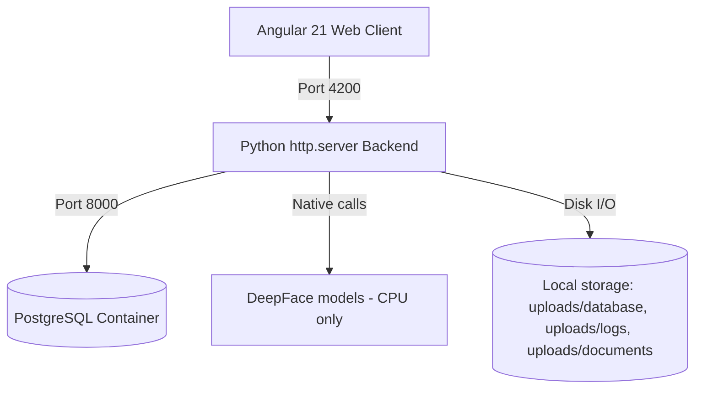

# 🤖 Employee Face AI

**Local, offline-capable HR kiosk & management system** that checks employees in/out via facial recognition and reads their dominant mood at every scan — no cloud, no external API calls, all inference runs on your own machine.


-6f42c1)

-lightgrey?logo=apple&logoColor=white)

---

## 📌 What it does

- **Kiosk check-in/out** — an employee steps up to the camera, the system matches their face against a local photo database and logs `CHECK_IN`/`CHECK_OUT`, along with their detected emotion (happy, sad, angry, neutral, ...).
- **HR admin console** — dashboard with attendance analytics (peak hours, mood distribution, CSV export), full employee directory, and a per-employee profile covering career positions, compensation history, skills, and project assignments.
- **Staff self-service portal** — employees can log in with their own username/password to view a read-only copy of their own profile and attendance stats.
- Every request runs against your **local PostgreSQL** instance and **local DeepFace models** — nothing leaves the machine.

## 🏗️ Architecture



| Layer | Stack |
|---|---|
| Frontend | Angular 21 (standalone components, Signals, SCSS, Vitest) |
| Backend | Pure Python `http.server` — no framework |
| Face recognition / emotion analysis | [DeepFace](https://github.com/serengil/deepface) (TensorFlow, CPU-only) |
| Database | PostgreSQL 15 (Docker) |
| Auth | Username + password, access/refresh token sessions |

## 🚀 Getting started

### Prerequisites
- Python 3.11 + a virtualenv with the packages in `requirements.txt`
- Node.js + npm (for the Angular frontend)
- Docker (for the PostgreSQL container)

### Setup

```bash
# 1. Environment variables (DB credentials — see .env.example for defaults)
cp .env.example .env

# 2. Python backend
python3 -m venv venv
./venv/bin/pip install -r requirements.txt

# 3. Frontend dependencies
cd frontend && npm install && cd ..
```

### Run everything

```bash
./start.sh
```

This spins up the Postgres container, the Python API (port `8000`), and the Angular dev server (port `4200`) in one shot.

| Route | Description |
|---|---|
| `http://localhost:4200/` | Biometric kiosk (check-in/out) |
| `http://localhost:4200/login` | Admin / staff login |
| `http://localhost:4200/admin` | HR admin console (requires admin login) |
| `http://localhost:4200/staff` | Staff self-service profile (requires staff login) |
| `http://localhost:8000/api/` | Backend REST API |

### Running tests

```bash
cd frontend
npm test
```

## 📁 Project structure

```
├── server.py          # Python HTTP API (auth, employees, attendance, face recognition)
├── db.py              # PostgreSQL schema, queries, session management
├── docker-compose.yml # Postgres container definition
├── start.sh           # One-command dev launcher
├── uploads/           # Runtime data: database/ (employee photos), logs/ (audit photos), documents/ (HR docs)
└── frontend/          # Angular application (kiosk, login, admin, staff)
```

See [AGENTS.md](AGENTS.md) for the full architecture reference, database schema, and development conventions.
