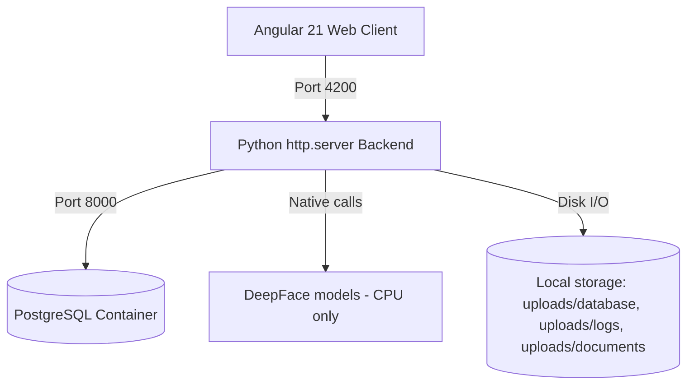

# 🤖 Employee Face AI

**Local, offline-capable HR kiosk & management system** that checks employees in/out via facial recognition and reads their dominant mood at every scan — no cloud, no external API calls, all inference runs on your own machine.


-6f42c1)

-lightgrey?logo=apple&logoColor=white)

---

## 📌 What it does

- **Kiosk check-in/out** — an employee steps up to the camera, the system matches their face against a local photo database and logs `CHECK_IN`/`CHECK_OUT`, along with their detected emotion (happy, sad, angry, neutral, ...).
- **HR admin console** — dashboard with attendance analytics (peak hours, mood distribution, CSV export), full employee directory, and a per-employee profile covering career positions, compensation history, skills, and project assignments.
- **Staff self-service portal** — employees can log in with their own username/password to view a read-only copy of their own profile and attendance stats.
- Every request runs against your **local PostgreSQL** instance and **local DeepFace models** — nothing leaves the machine.

## 🏗️ Architecture



| Layer | Stack |
|---|---|
| Frontend | Angular 21 (standalone components, Signals, SCSS, Vitest) |
| Backend | Pure Python `http.server` — no framework |
| Face recognition / emotion analysis | [DeepFace](https://github.com/serengil/deepface) (TensorFlow, CPU-only) |
| Database | PostgreSQL 15 (Docker) |
| Auth | Username + password, access/refresh token sessions |

## 🚀 Getting started

### Prerequisites
- Python 3.11 + a virtualenv with the packages in `requirements.txt`
- Node.js + npm (for the Angular frontend)
- Docker (for the PostgreSQL container)

### Setup

```bash
# 1. Environment variables (DB credentials — see .env.example for defaults)
cp .env.example .env

# 2. Python backend
python3 -m venv venv
./venv/bin/pip install -r requirements.txt

# 3. Frontend dependencies
cd frontend && npm install && cd ..
```

### Run everything

```bash
./start.sh
```

This spins up the Postgres container, the Python API (port `8000`), and the Angular dev server (port `4200`) in one shot.

| Route | Description |
|---|---|
| `http://localhost:4200/` | Biometric kiosk (check-in/out) |
| `http://localhost:4200/login` | Admin / staff login |
| `http://localhost:4200/admin` | HR admin console (requires admin login) |
| `http://localhost:4200/staff` | Staff self-service profile (requires staff login) |
| `http://localhost:8000/api/` | Backend REST API |

### Running tests

```bash
cd frontend
npm test
```

## 📖 Hướng dẫn sử dụng

> Phần này dành cho người dùng cuối (không cần biết kỹ thuật). Có 3 nhóm
> người dùng: **mọi nhân viên** chấm công ở kiosk (không cần đăng nhập),
> **Nhân viên (Staff)** xem hồ sơ/gửi đơn nghỉ/nhắn tin của riêng mình, và
> **Quản lý (Admin)** quản lý toàn bộ hệ thống.

### 1. Chấm công tại kiosk (không cần đăng nhập)


Mở trình duyệt tại địa chỉ gốc của hệ thống (ví dụ `http://<địa-chỉ-máy-chủ>/`).

1. Cho phép trình duyệt truy cập camera khi được hỏi.
2. Chọn **CHECK IN** (bắt đầu ca) hoặc **CHECK OUT** (kết thúc ca).
3. Nhấn **BẮT ĐẦU QUÉT KHUÔN MẶT** và nhìn thẳng vào camera.
4. Hệ thống chụp một ảnh, nhận diện khuôn mặt và tự động ghi nhận tên nhân
   viên, hành động (check in/out), thời gian, và trạng thái cảm xúc lúc quét
   — dùng để thống kê chỉ số hạnh phúc trên dashboard Admin, không dùng để
   đánh giá cá nhân.
5. Nếu báo lỗi "không nhận diện được", hãy quét lại với ánh sáng tốt hơn,
   nhìn thẳng vào camera hơn.

> Máy chấm công cần có webcam thật. Nếu server chạy ở một địa chỉ/tên miền
> thật (không phải `localhost`), trình duyệt chặn quyền camera trừ khi có
> HTTPS — xem [`deploy/README.md`](deploy/README.md).

### 2. Đăng nhập


Vào `/login`.

- **Admin**: đăng nhập bằng tài khoản quản trị (username/mật khẩu do người
  triển khai hệ thống cấp qua `.env` lúc cài đặt).
- **Nhân viên**: chỉ đăng nhập được nếu Admin đã cấp mật khẩu cho tài khoản đó
  (mục 3.2 bên dưới) — nhân viên mới tạo mặc định **chưa** có mật khẩu đăng
  nhập, chỉ chấm công được ở kiosk cho đến khi được cấp.

Đăng nhập thành công sẽ tự chuyển đến đúng khu vực (Admin → Bảng điều khiển,
Nhân viên → Trang cá nhân).

### 3. Dành cho Quản lý (Admin)

#### 3.1. Bảng thống kê (Dashboard)


Trang đầu tiên sau khi đăng nhập admin:
- Lọc theo khoảng ngày, trạng thái, tên nhân viên.
- Xem tổng số nhân sự, số lượt chấm công, chỉ số hạnh phúc trung bình.
- Xem biểu đồ giờ cao điểm chấm công và phân bố cảm xúc.
- Xem danh sách lượt chấm công chi tiết (kèm ảnh chụp lúc quét), xuất báo cáo
  ra file CSV bằng nút **XUẤT BÁO CÁO CSV**.

#### 3.2. Quản lý Nhân viên


- **Xem danh sách**: tìm theo tên, ID hoặc vị trí.
- **Đăng ký nhân viên mới**: nút **ĐĂNG KÝ NHÂN VIÊN MỚI** — nhập tên, ngày
  sinh, vị trí, lương khởi điểm, vai trò (Staff/Admin), username, **mật khẩu
  đăng nhập** (để trống nếu nhân viên đó chỉ cần chấm công, không cần đăng
  nhập xem hồ sơ), và chụp/tải lên ảnh khuôn mặt để hệ thống nhận diện.
- **Xem hồ sơ chi tiết** (nút "Xem hồ sơ" trên từng dòng): sửa thông tin cơ
  bản, đổi ảnh đại diện, đổi mật khẩu đăng nhập, thêm lịch sử thăng tiến/tăng
  lương, cập nhật kỹ năng và dự án đã tham gia, xem thống kê chấm công riêng
  của nhân viên đó.
- **Xóa nhân viên**: nút "Xóa" trên từng dòng (không áp dụng cho tài khoản Admin).

#### 3.3. Đơn xin nghỉ


- Lọc theo trạng thái (Chờ duyệt / Đã duyệt / Từ chối), theo ngày, theo tên/vị trí.
- Với đơn **đang chờ duyệt**: nút **Duyệt** hoặc **Từ chối** (khi từ chối có
  thể ghi lý do — nhân viên sẽ thấy lý do này trong trang cá nhân của họ).

#### 3.4. Tài liệu nhân sự


- Nút **TẢI LÊN TÀI LIỆU MỚI**: chọn nhân viên nhận (hoặc để trống = gửi cho
  **toàn bộ nhân viên**), tải file lên hoặc dán một đường link, rồi lưu.
- Danh sách hiển thị ai được xem, ngày tải lên; nhân viên sẽ thấy tài liệu
  tương ứng trong trang cá nhân của họ.

#### 3.5. Tin nhắn nội bộ


- Tab **ĐÃ NHẬN / ĐÃ GỬI** để xem hộp thư.
- Nút **Soạn tin nhắn mới**: chọn người nhận, loại tin nhắn, tiêu đề, nội
  dung (có định dạng chữ đậm/nghiêng/tiêu đề/màu chữ/cỡ chữ, chèn ảnh, vẽ
  hình minh họa). Có thể chọn một **mẫu có sẵn** để tự động điền tiêu đề/nội
  dung.
- Xóa một tin nhắn chỉ ẩn nó ở phía bạn — người còn lại vẫn thấy bình thường
  cho đến khi họ cũng xóa.

#### 3.6. Mẫu tin nhắn

Tạo/sửa/xóa các mẫu nội dung dùng lại nhiều lần (ví dụ "Mẫu báo cáo ngày
chuẩn") để khi soạn tin nhắn mới có thể chọn nhanh thay vì gõ lại từ đầu.

### 4. Dành cho Nhân viên (Staff)


Sau khi đăng nhập, vào thẳng **Trang cá nhân**, gồm:

- **Hồ sơ của tôi**: ảnh đại diện, vị trí, tuổi, có thể tự **đổi ảnh đại
  diện** và **đổi mật khẩu** đăng nhập (không thể tự sửa lương/chức vụ — chỉ
  Admin làm được).
- **Xin nghỉ phép**: nút **Xin nghỉ phép** — chọn từ ngày, đến ngày, lý do,
  rồi **Gửi đơn**. Theo dõi trạng thái đơn (Chờ duyệt/Đã duyệt/Từ chối, kèm
  lý do nếu bị từ chối) ngay trong mục **ĐƠN XIN NGHỈ ĐÃ GỬI**.
- **Tài liệu của tôi**: tài liệu Admin gửi riêng cho bạn hoặc gửi chung cho
  toàn công ty — bấm để tải xuống hoặc mở link.
- **Lịch sử thăng tiến / thu nhập / kỹ năng / dự án**: chỉ xem, không sửa được.
- **Thống kê chấm công**: số ngày công, tổng giờ làm, biểu đồ cảm xúc trong
  khoảng thời gian đã chọn; có thể lọc theo ngày.
- **Tin nhắn**: cùng tính năng nhắn tin nội bộ như Admin (mục 3.5), truy cập
  qua menu bên trái.

### 5. Câu hỏi thường gặp

**Nhân viên quét mặt ở kiosk nhưng báo "không tìm thấy nhân viên phù hợp"?**
Nhân viên đó chưa được đăng ký ảnh khuôn mặt, hoặc ảnh đăng ký quá khác so
với hiện tại — vào **Quản lý Nhân viên → Xem hồ sơ → Đổi ảnh đại diện** để
chụp lại ảnh rõ mặt hơn.

**Nhân viên không đăng nhập được?**
Kiểm tra xem tài khoản đó đã được Admin cấp **mật khẩu đăng nhập** chưa
(mục 3.2) — nhân viên mới tạo mặc định không có mật khẩu, chỉ chấm công được.

**Camera ở kiosk không hoạt động khi mở bằng địa chỉ IP/tên miền thật (không
phải khi chạy thử ở máy lập trình)?**
Trình duyệt chặn quyền camera trên kết nối HTTP thường — cần bật HTTPS, xem
[`deploy/README.md`](deploy/README.md).

## 🚢 Deploying to a real server

`./start.sh` above is for local development only (`ng serve` + `python
server.py` run directly). For a real server — customer's VPS or an on-prem
box — see [`deploy/README.md`](deploy/README.md), or just run:

```bash
sudo ./deploy/install.sh                                   # HTTP only (LAN/internal use)
sudo ./deploy/install.sh yourdomain.com you@yourdomain.com  # + HTTPS via Let's Encrypt
```

## 📁 Project structure

```
├── server.py          # Python HTTP API (auth, employees, attendance, face recognition)
├── db.py              # PostgreSQL schema, queries, session management
├── docker-compose.yml # Postgres container definition
├── start.sh           # One-command dev launcher
├── uploads/           # Runtime data: database/ (employee photos), logs/ (audit photos), documents/ (HR docs)
└── frontend/          # Angular application (kiosk, login, admin, staff)
```

See [AGENTS.md](AGENTS.md) for the full architecture reference, database schema, and development conventions.
