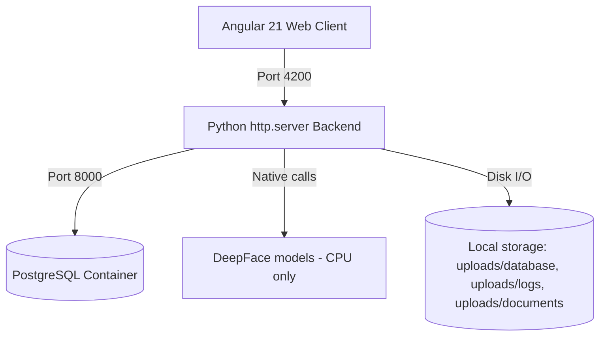
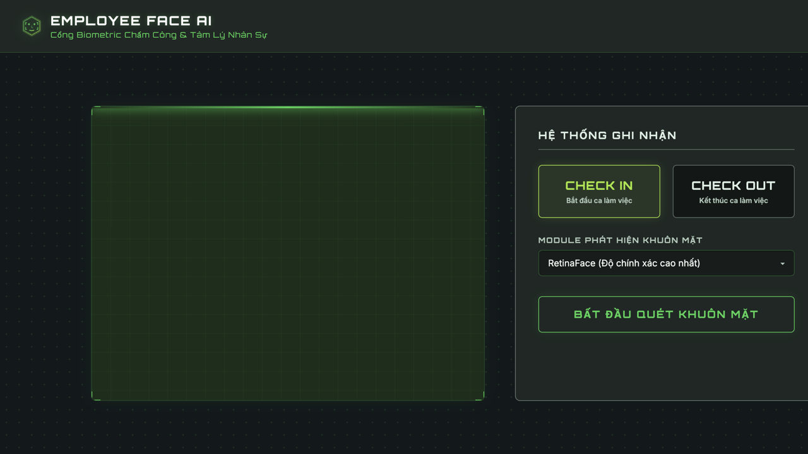
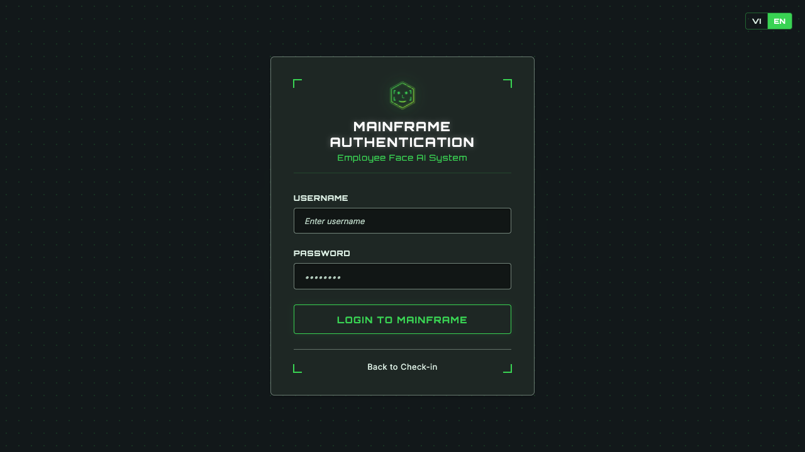
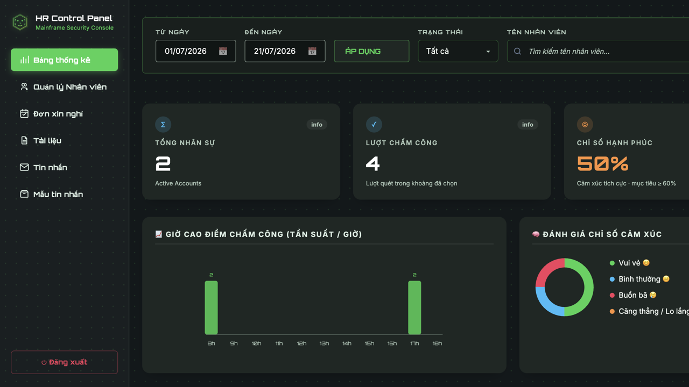
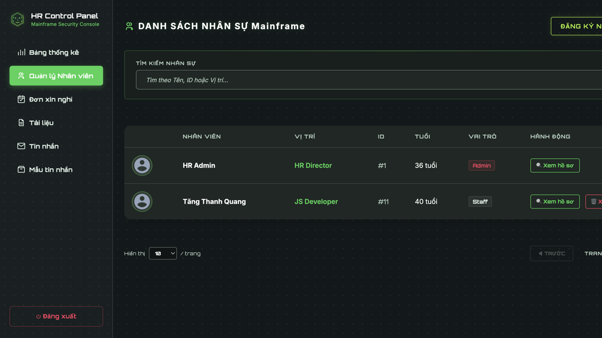
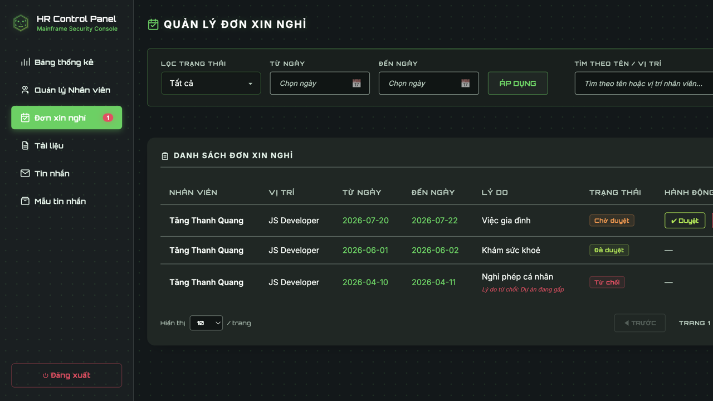
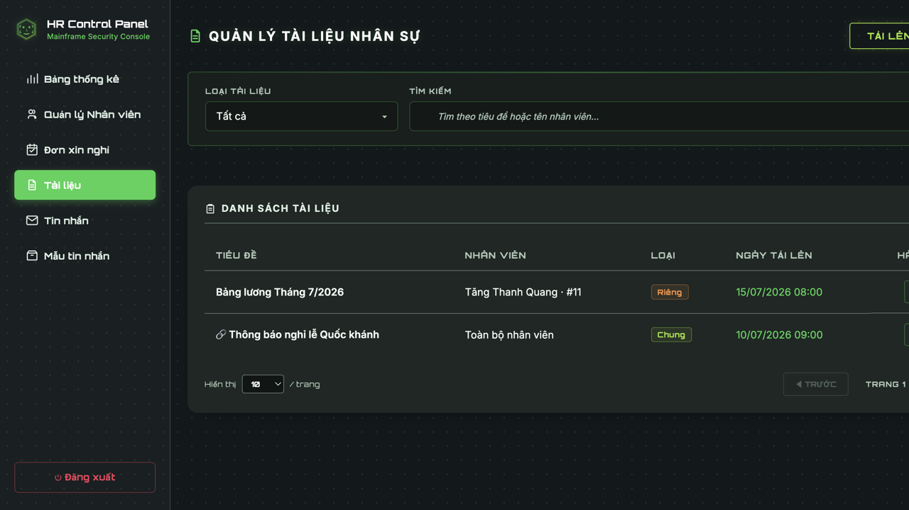
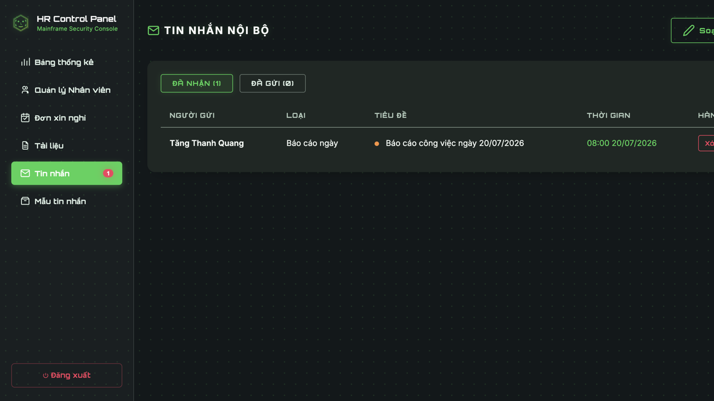
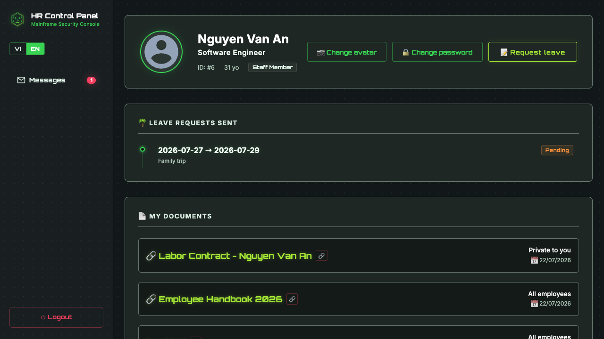

# 🤖 Employee Face AI

**Local, offline-capable HR kiosk & management system** that checks employees in/out via facial recognition and reads their dominant mood at every scan — no cloud, no external API calls, all inference runs on your own machine.


-6f42c1)

-lightgrey?logo=apple&logoColor=white)
[](https://js-tools.org/donate)

---

## 📌 What it does

- **Kiosk check-in/out** — an employee steps up to the camera, the system matches their face against a local photo database and logs `CHECK_IN`/`CHECK_OUT`, along with their detected emotion (happy, sad, angry, neutral, ...).
- **HR admin console** — dashboard with attendance analytics (peak hours, mood distribution, CSV export), full employee directory, and a per-employee profile covering career positions, compensation history, skills, and project assignments.
- **Staff self-service portal** — employees can log in with their own username/password to view a read-only copy of their own profile and attendance stats.
- Every request runs against your **local PostgreSQL** instance and **local DeepFace models** — nothing leaves the machine.

## 🏗️ Architecture



| Layer | Stack |
|---|---|
| Frontend | Angular 21 (standalone components, Signals, SCSS, Vitest) |
| Backend | Pure Python `http.server` — no framework |
| Face recognition / emotion analysis | [DeepFace](https://github.com/serengil/deepface) (TensorFlow, CPU-only) |
| Database | PostgreSQL 15 (Docker) |
| Auth | Username + password, access/refresh token sessions |

## 🚀 Getting started

### Prerequisites
- Python 3.11 + a virtualenv with the packages in `requirements.txt`
- Node.js + npm (for the Angular frontend)
- Docker (for the PostgreSQL container)

### Setup

```bash
# 1. Environment variables (DB credentials — see .env.example for defaults)
cp .env.example .env

# 2. Python backend
python3 -m venv venv
./venv/bin/pip install -r requirements.txt

# 3. Frontend dependencies
cd frontend && npm install && cd ..
```

### Run everything

```bash
./start.sh
```

This spins up the Postgres container, the Python API (port `8000`), and the Angular dev server (port `4200`) in one shot.

| Route | Description |
|---|---|
| `http://localhost:4200/` | Biometric kiosk (check-in/out) |
| `http://localhost:4200/login` | Admin / staff login |
| `http://localhost:4200/admin` | HR admin console (requires admin login) |
| `http://localhost:4200/staff` | Staff self-service profile (requires staff login) |
| `http://localhost:8000/api/` | Backend REST API |

### Running tests

```bash
cd frontend
npm test
```

## 📖 User guide

> This section is for end users (no technical background needed). There are
> 3 groups of users: **every employee** clocks in/out at the kiosk (no login
> needed), **Staff** view their own profile / submit leave requests / send
> messages, and **Admin** manages the whole system.

### 1. Clocking in at the kiosk (no login needed)



Open a browser at the system's root address (e.g. `http://<server-address>/`).

1. Allow the browser to access the camera when prompted.
2. Choose **CHECK IN** (start of shift) or **CHECK OUT** (end of shift).
3. Press **START FACE SCAN** and look straight at the camera.
4. The system takes a photo, recognizes the face, and automatically records
   the employee's name, the action (check in/out), the time, and the mood
   detected at that moment — used for the happiness-index stats on the Admin
   dashboard, not for individual performance evaluation.
5. If it reports "employee not recognized," scan again with better lighting
   and look more directly at the camera.

> The kiosk machine needs a real webcam. If the server runs at a real
> address/domain (not `localhost`), the browser blocks camera access unless
> HTTPS is enabled — see [`deploy/README.md`](deploy/README.md).

### 2. Logging in



Go to `/login`.

- **Admin**: log in with the admin account (username/password set by
  whoever deployed the system, via `.env` at install time).
- **Staff**: can only log in once an Admin has set a password for that
  account (see section 3.2 below) — newly created employees have **no**
  login password by default and can only clock in at the kiosk until one is set.

A successful login redirects to the right area automatically (Admin →
Dashboard, Staff → Personal profile page).

### 3. For Admins

#### 3.1. Dashboard



The first page after an admin login:
- Filter by date range, status, employee name.
- View total headcount, number of check-ins/outs, average happiness index.
- View a chart of peak attendance hours and mood distribution.
- View the detailed attendance log (with the photo captured at scan time),
  export it as CSV via the **EXPORT CSV REPORT** button.

#### 3.2. Employee management



- **View the list**: search by name, ID, or position.
- **Register a new employee**: the **REGISTER NEW EMPLOYEE** button — enter
  name, date of birth, position, starting salary, role (Staff/Admin),
  username, **login password** (leave blank if this employee only needs to
  clock in and doesn't need to log in and view their profile), and
  capture/upload a face photo for recognition.
- **View full profile** (the **View profile** button on each row): edit basic
  info, change avatar, change login password, add career-position/raise
  history, update skills and projects, view that employee's own attendance stats.
- **Delete an employee**: the **Delete** button on each row (not available for Admin accounts).

#### 3.3. Leave requests



- Filter by status (Pending / Approved / Rejected), by date, by name/position.
- For a **pending** request: **Approve** or **Reject** button (rejecting
  lets you record a reason — the employee will see it on their own profile page).

#### 3.4. HR documents



- The **UPLOAD NEW DOCUMENT** button: choose the recipient employee (or
  leave it blank to send to **every employee**), upload a file or paste a
  link, then save.
- The list shows who can see it and the upload date; employees see the
  matching document on their own profile page.

#### 3.5. Internal messages



- **Received / Sent** tabs for the inbox.
- The **Compose new message** button: pick a recipient, message category,
  subject, content (supports bold/italic/headings/text color/font size,
  inserting images, drawing illustrations). A saved **template** can be
  picked to auto-fill the subject/content.
- Deleting a message only hides it on your side — the other party still
  sees it normally until they delete it too.

#### 3.6. Message templates

Create/edit/delete reusable content templates (e.g. a "standard daily
report template") so composing a new message can pick one instantly instead
of typing it from scratch.

### 4. For Staff



After logging in, staff land straight on their **Personal profile page**, which has:

- **My profile**: avatar, position, age; can self-service **change avatar**
  and **change login password** (cannot edit salary/position themselves —
  only an Admin can).
- **Request leave**: the **Request leave** button — pick a start date, end
  date, reason, then **SUBMIT REQUEST**. Track the request's status
  (Pending/Approved/Rejected, with the rejection reason if applicable) right
  in the **LEAVE REQUESTS SENT** section.
- **My documents**: documents an Admin sent just to you or broadcast to the
  whole company — click to download or open the link.
- **Career / income / skills / project history**: view-only, cannot be edited.
- **Attendance stats**: days worked, total hours, a mood chart over the
  selected time range; can filter by date.
- **Messages**: the same internal messaging feature as Admin (section 3.5),
  accessible from the left-hand menu.

### 5. FAQ

**An employee scans their face at the kiosk but gets "employee not recognized"?**
That employee hasn't registered a face photo yet, or the registered photo
looks too different from how they look now — go to **Employee management →
View profile → Change avatar** to capture a clearer photo.

**An employee can't log in?**
Check whether that account has been given a **login password** by an Admin
yet (section 3.2) — newly created employees have no password by default and
can only clock in at the kiosk.

**The kiosk camera doesn't work when opened at a real IP/domain (works fine
when testing on a dev machine)?**
Browsers block camera access on a plain HTTP connection — HTTPS needs to be
enabled, see [`deploy/README.md`](deploy/README.md).

## 🚢 Deploying to a real server

`./start.sh` above is for local development only (`ng serve` + `python
server.py` run directly). For a real server — customer's VPS or an on-prem
box — see [`deploy/README.md`](deploy/README.md), or just run:

```bash
sudo ./deploy/install.sh                                   # HTTP only (LAN/internal use)
sudo ./deploy/install.sh yourdomain.com you@yourdomain.com  # + HTTPS via Let's Encrypt
```

## 📁 Project structure

```
├── server.py          # Python HTTP API (auth, employees, attendance, face recognition)
├── db.py              # PostgreSQL schema, queries, session management
├── docker-compose.yml # Postgres container definition
├── start.sh           # One-command dev launcher
├── uploads/           # Runtime data: database/ (employee photos), logs/ (audit photos), documents/ (HR docs)
└── frontend/          # Angular application (kiosk, login, admin, staff)
```

See [AGENTS.md](AGENTS.md) for the full architecture reference, database schema, and development conventions.

## ❤️ Support this project

If this project is useful to you, consider supporting its development:
**[https://js-tools.org/donate](https://js-tools.org/donate)**
